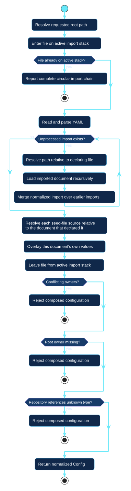

# Configuration loading

Loading converts a graph of YAML documents into one normalized `Config` before
repository discovery begins.

[Open the PlantUML source](../../assets/diagrams/sources/configuration-loading.puml)

## Invariants

- Import paths and file seed sources resolve relative to their declaring file.
- Imports compose in declaration order; the declaring document overlays them.
- A preset may omit `owner`, but the resolved root must contain exactly one
  nonconflicting owner.
- Circular imports fail with the active chain rather than recursing silently.
- Explicit repository types must name entries present under `types`.
- Any loading failure occurs before GitHub reads or writes.

The loader resolves documents, not repository policy. Defaults, types, and
named repository fields remain distinct until
[policy resolution](policy-resolution.md).
