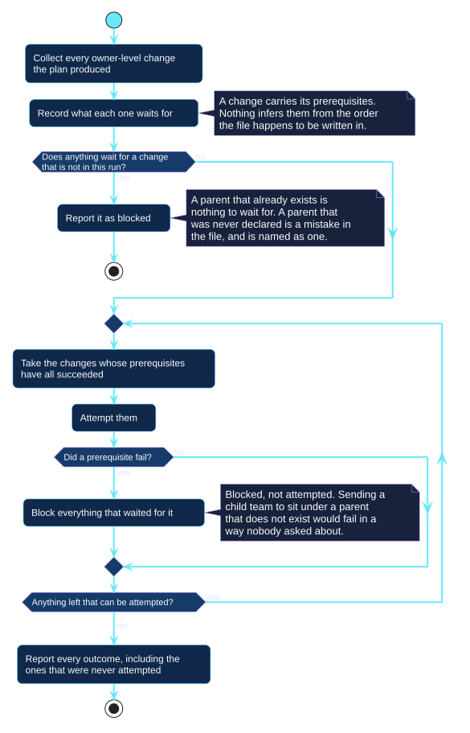
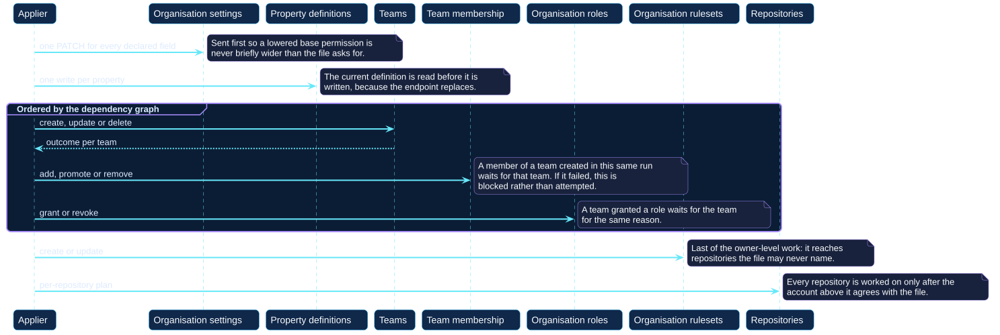

# Owner reconciliation

Everything else Octoform reconciles belongs to a repository. The account above
them is reconciled the same way — observe, compare, plan, confirm, apply — with
two differences that this page is about: the settings reach further, and the
resources refer to each other.

## Ordering as a property of the model

Repository work has an order, but the order is short and could be written down.
Owner work cannot be, because what has to happen first depends on what the
configuration says:

- A child team waits for a parent **only if this run is creating that parent**.
  A parent that already exists is nothing to wait for.
- Somebody joining a team waits for the team **only if the team is new**.
- A team granted an organization role waits for the team, for the same reason.
- A repository setting waits for the repository to be unarchived, but only if
  it was archived.

So a change carries its prerequisites, and the applier reads them.

[Open the PlantUML source](../../assets/diagrams/sources/owner-dependency-graph.puml)

The graph does two things, and the second is the one that matters:

1. **It attempts a prerequisite first**, whatever order the file is written in.
2. **It blocks — rather than attempts — anything whose prerequisite failed.**

Without the second, a failed team creation would be followed by a request to
add somebody to a team that does not exist, which fails for a second time and
for a reason that has nothing to do with what actually went wrong. Blocked
work says what it was waiting for.

## The order the graph produces

[Open the PlantUML source](../../assets/diagrams/sources/owner-apply-order.puml)

| Step | Why here |
| --- | --- |
| Organization settings | First, so a lowered base permission is never briefly wider than the file asks for. One `PATCH` for every declared field. |
| Property definitions | Before rulesets that select on them. Each is read before it is written, because the endpoint replaces. |
| Teams, membership, roles | Ordered among themselves by the graph. |
| Organization rulesets | Last of the owner-level work, because they reach furthest — including repositories no configuration names. |
| Repositories | Only after the account agrees with the file. |

## Reading, and the shape of not knowing

The account is read once per run. Each part of it is independently readable or
not, and each failure blocks only what depended on it:

| Unreadable | Blocks |
| --- | --- |
| The settings | Every declared profile and member field |
| The property definitions | **Every** declared definition, not only the ones that look different |
| The teams | Every declared team, and every membership |
| One team's membership | That team's membership only |
| The roles | Every declared assignment |
| One role's holders | That role only |

The second row is the interesting one, and it is a consequence of the endpoint
rather than a choice. GitHub's property-definition write replaces the whole
definition. Writing one without the definition that currently stands is not an
uninformed change to one field; it is an uninformed change to all of them. So a
definition that could not be read is a definition that cannot be written.

## Refusals that GitHub would not make

Several things are refused here that the API would perform happily. Each is a
decision taken because performing it would leave nobody able to undo it, or
because the file is asking for two contradictory things:

| Refused | Because |
| --- | --- |
| An authoritative team membership or role naming nobody | It empties the team, or revokes the role from everybody. That is what a half-rendered template looks like. |
| An authoritative block that would remove the account the run is authenticated as | It can be the last change that account is able to make. |
| Removing the only remaining owner | An organization with no owners cannot be administered by anybody. |
| Deleting a team whose children the configuration declares should exist | GitHub deletes children with their parent, so the file is asking for both. |
| A team whose parents lead back to itself | Nothing could create it. |
| A secret team with a parent, or with children | GitHub does not keep that shape. |
| A role name that matches no existing role | There is no endpoint that creates one, so it is a name rather than a definition. |
| An organization ruleset selecting repositories by name *and* by property | GitHub's conditions take one repository form. |
| A `merge_queue` rule on an organization ruleset | It is not among the rules an organization ruleset can carry. |

Every one of them is a line in the plan with the reason attached, not an
exception thrown partway through an apply.

## Where the risk levels come from

Reach, not effort. A setting is `sensitive` when it decides something about
repositories beyond the ones the plan names:

- The base permission and the creation switches: every repository the
  organization owns, including ones no policy mentions.
- An organization ruleset: whatever its condition matched.
- An organization role: the whole organization.
- A repository custom property value: which organization rulesets reach that
  repository.

And `destructive` when GitHub does not keep what was removed — a deleted team
and its children, a deleted property definition and every value repositories
held for it, somebody taken off a team and therefore out of every repository it
reached.

## Related

- [The organization block](../../configuration/organization.md)
- [Teams and membership](../../configuration/teams.md)
- [Plan and apply](plan-and-apply.md)
- [Incidents and recovery](../../security/incidents-and-recovery.md)
