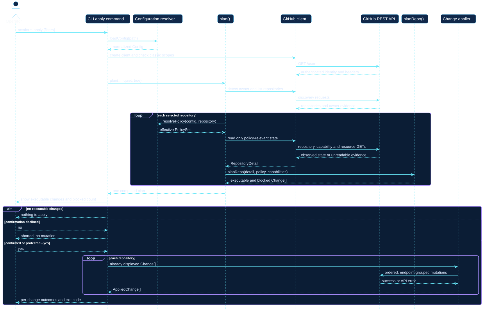
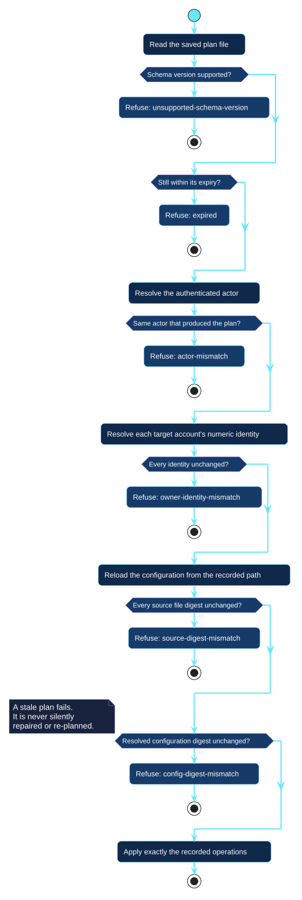

# Plan and apply sequence

The sequence view follows one `apply` invocation. It shows that the command
calls the shared planning implementation once and retains its result for
confirmation and execution.

[Open the PlantUML source](../../assets/diagrams/sources/plan-apply-sequence.puml)

## Consistency boundary

The displayed plan and attempted changes share one in-memory `Change[]`.
Blocked entries are retained for reporting and filtered before the applier.
Declining confirmation terminates the invocation without writes.

`octoform plan` followed by a separate `octoform apply` means two observations
and two plans, which is the right shape interactively and the wrong one across
a job boundary. To close that gap, `plan --out` writes the reviewed plan and
`apply --plan` performs exactly it.

## Saved plan verification

Every claim a saved plan makes is re-checked before anything is touched, and
each failure is a distinct named reason rather than a single generic "stale
plan" — the operator needs to know which check failed to decide whether to
re-plan or investigate.

[Open the PlantUML source](../../assets/diagrams/sources/saved-plan-verification.puml)

The checks run in that order deliberately: the cheap, offline ones fail first,
so an expired plan never spends a request. Verification performs no requests of
its own beyond resolving the actor and each account's identity, which the
caller gathers once.

The artifact's trust boundary is the filesystem's. Its digests detect a plan
that no longer matches the world it was made in — a changed configuration, a
renamed account, a different token — not an attacker who can rewrite files in
the workspace. It is neither signed nor encrypted, and does not claim to be.

## Failure boundary

The applier orders and groups endpoint-compatible changes. One group failure
does not stop unrelated groups, and no distributed transaction rolls successful
groups back. A fresh plan is the source of truth after partial failure.

Use the [plan and apply guide](../../guides/plan-and-apply.md) for the operator
procedure and [command reference](../../commands/apply.md) for exact exit behavior.
