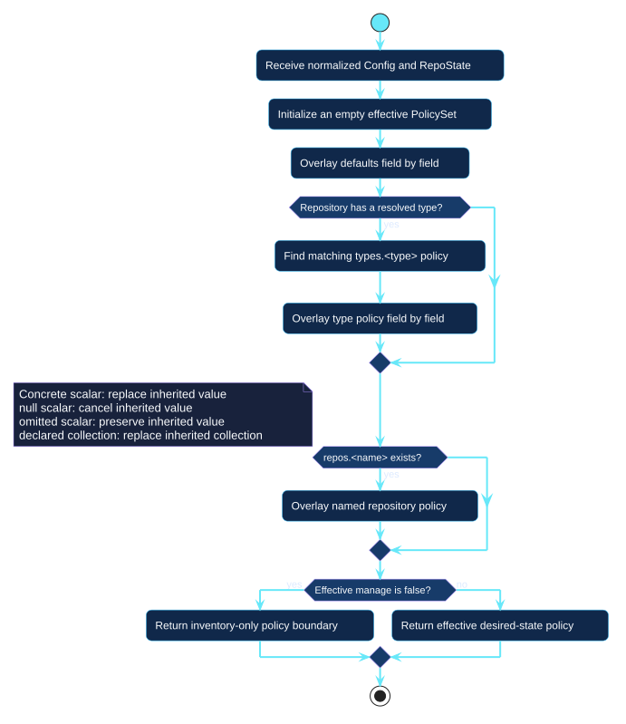

# Policy resolution

Resolution produces one effective `PolicySet` for a selected repository. It
operates field by field after document composition and type discovery.

<div class="octoform-diagram" role="region" aria-label="Scrollable UML policy resolution activity diagram" tabindex="0" markdown>



</div>

[Open the PlantUML source](../../assets/diagrams/sources/policy-resolution.puml)

## Precedence

```text
defaults -> types.<resolved-type> -> repos.<repository-name>
```

A concrete scalar replaces its inherited value, `null` cancels an inherited
scalar, and omission preserves it. A declared resource collection replaces the
collection inherited from a wider layer.

`manage: false` terminates desired-state planning for the repository but keeps
inventory and audit visibility. Exclusion happens earlier in repository
selection and removes the repository completely.

See [selection and precedence](../../configuration/selection-and-precedence.md)
for the complete customer-facing configuration contract.
