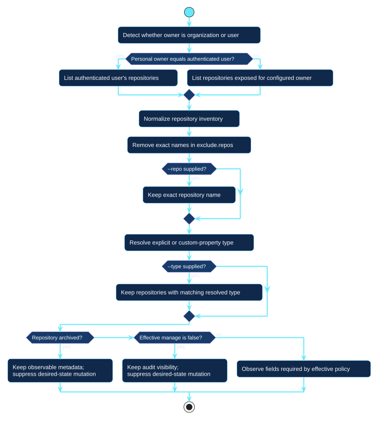

# Repository selection

Selection decides which repositories remain visible and which ones may proceed
to desired-state observation. It is separate from policy comparison.

[Open the PlantUML source](../../assets/diagrams/sources/repository-selection.puml)

## Discovery rules

- An organization owner uses organization repository discovery exposed to the
  credential.
- A personal owner matching the authenticated user can include private
  repositories visible through authenticated-user discovery.
- Another personal owner exposes only repositories GitHub makes public for
  that user.

Exact exclusions are removed first. `--repo` and `--type` then narrow command
scope. Type resolution uses `repos.<name>.type` before organization custom
property evidence.

Archived and `manage: false` repositories can remain visible to inventory or
audit, but desired-state mutation is suppressed. Observation then fetches only
the detailed settings and structures named by the effective policy.
