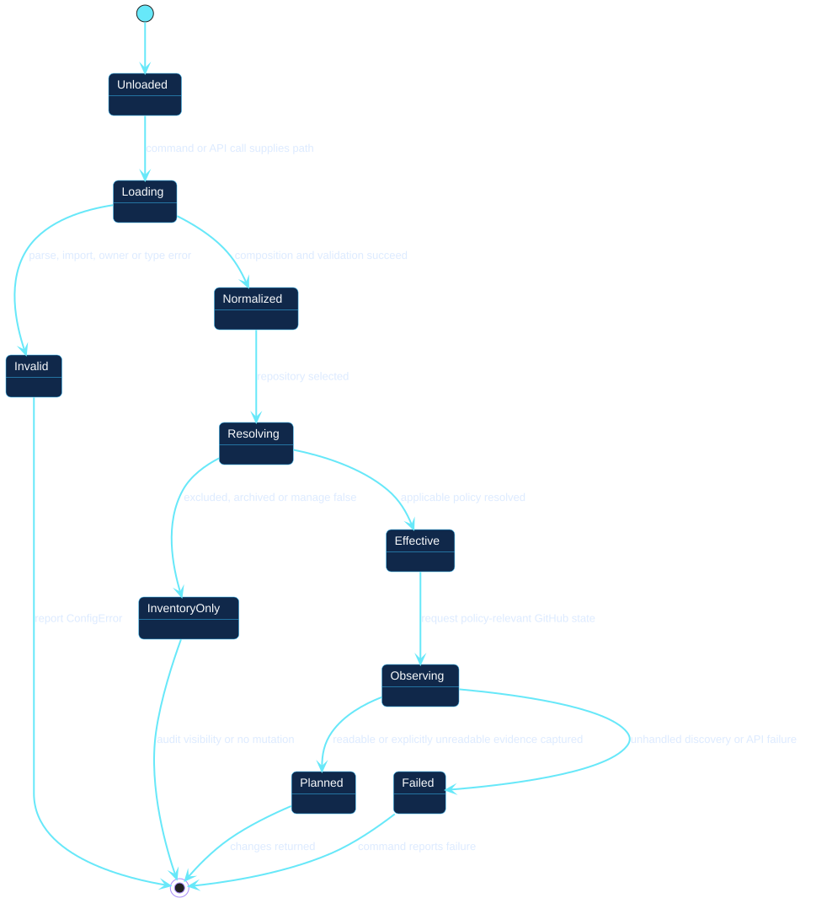
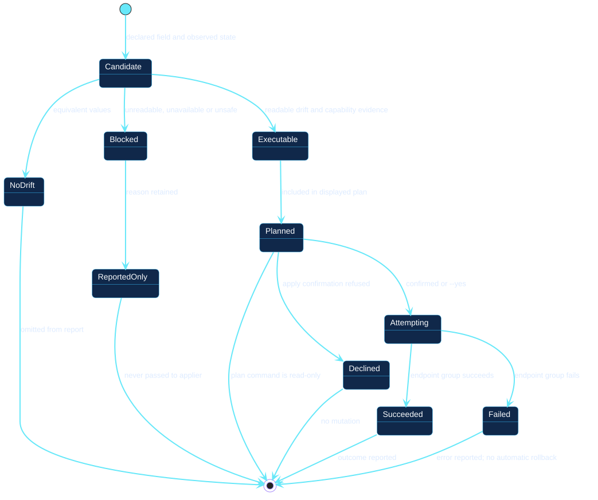

# State models

Two state machines separate configuration processing from the lifecycle of an
individual desired-state difference.

## Configuration lifecycle

[Open the PlantUML source](../../assets/diagrams/sources/configuration-lifecycle.puml)

A configuration becomes normalized only after composition and validation.
Resolution repeats for each repository. Inventory-only paths retain intentional
visibility without entering mutation planning. Observation can preserve an
explicit unreadable value inside a valid plan; only unhandled discovery or API
failure moves the operation to the failed state.

## Change lifecycle

[Open the PlantUML source](../../assets/diagrams/sources/change-lifecycle.puml)

A candidate becomes executable only when current state is readable, drift
exists, and capability evidence supports the operation. Blocked changes end as
reported-only evidence. Executable changes can end after read-only planning,
after declined confirmation, or after a reported success or failure.

No transition exists from blocked directly to attempting. The cause must
change, and a new invocation must observe and plan again.
