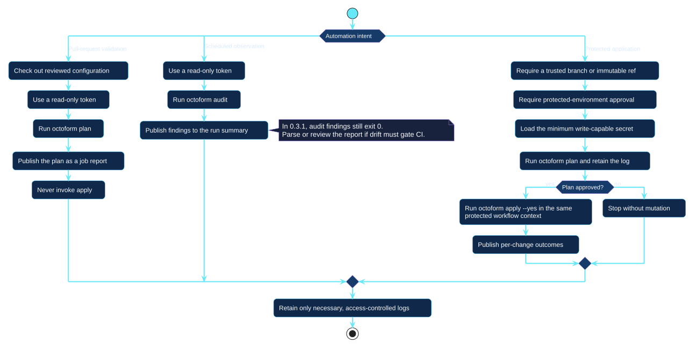

# Automation patterns

Automation intent determines the credential, command, approval boundary, and
meaning of success.

[Open the PlantUML source](../../assets/diagrams/sources/automation-pipelines.puml)

## Pattern comparison

| Pattern | Command | Credential | Mutation control |
| --- | --- | --- | --- |
| Pull-request validation | `plan` | Read-only for required repositories and settings | No apply step exists |
| Scheduled observation | `audit` | Read-only inventory access | Findings are reported and exit `1`, so the job fails on drift |
| Protected application | `apply --plan` | Minimum write permissions loaded only after approval | Trusted ref, the exact plan that was reviewed, protected environment, controlled logs |

A plan job can now hand a saved plan to a later apply job: `plan --out` writes
a versioned artifact, and `apply --plan` performs exactly the operations it
records or refuses with the reason. The artifact is not cryptographically
signed, and does not try to be — it detects a plan that no longer matches the
world it was made in, through the actor, each account's numeric identity, the
configuration and source digests, and an expiry. It carries the same trust as
the configuration file beside it: both are ordinary files on disk.

Protected apply without `--plan` still plans again in its own invocation and
displays that plan before the workflow approval or `--yes` boundary.

Copy the supported workflows from the [CI/CD automation guide](../../automation/index.md).
