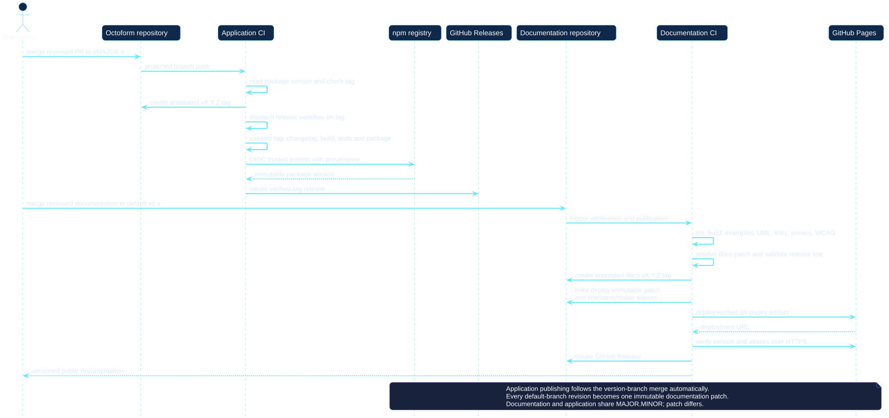

# Release pipelines

Application and documentation publication are automated but remain distinct.
The exact package version identifies an immutable executable. The documentation
publication tag identifies an editorial source revision, while Mike exposes
the compatible `MAJOR.MINOR` line described by that revision.

[Open the PlantUML source](../../assets/diagrams/sources/release-pipelines.puml)

## Application release

A reviewed merge to the version branch triggers version and tag checks, full
package verification, an annotated tag, npm trusted publishing through OIDC
with provenance, and a GitHub Release.

## Documentation release

Every reviewed revision reaching the default `v0.x` branch is verified and
receives a complete immutable publication tag. That editorial patch advances
independently within the documented Octoform `MAJOR.MINOR` line. Mike deploys
the release line—not the exact package patch or editorial tag—and updates
`latest` and `stable` only after successful verification and deployment.

For example, publication tag `v0.4.25` can update the public `0.4`
documentation while the build remains pinned to Octoform `0.4.0`.

See [Releases](../../releases/index.md) for the reader-facing version contract.
