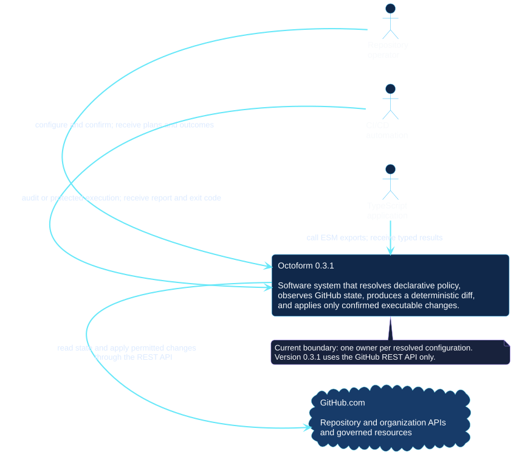
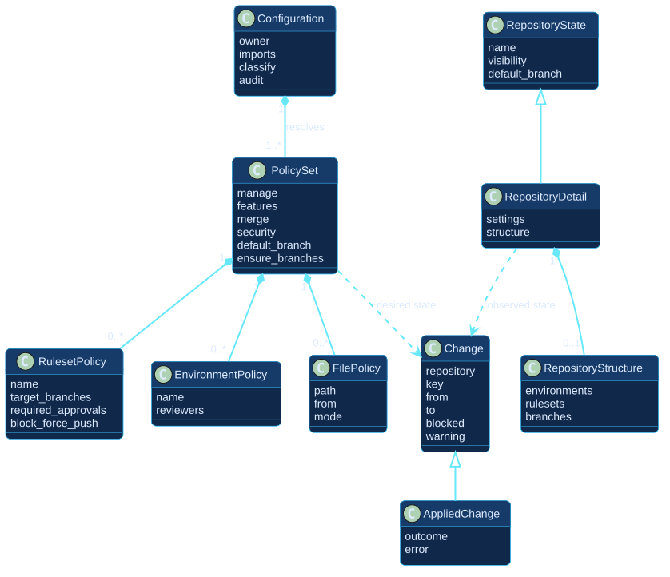
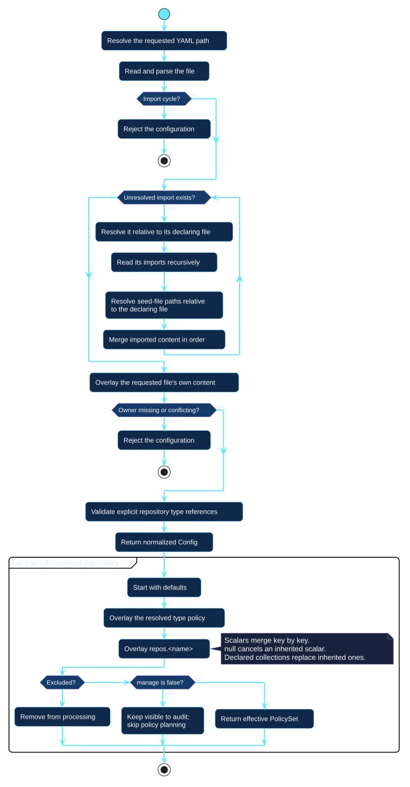

# Architecture

Octoform separates declaration, observation, planning, confirmation, and
mutation. These UML views describe the released `0.3.1` system from the
operator's goals down to runtime components and delivery controls. They do not
include planned multi-owner or organization-management capabilities.

Every diagram is rendered locally from reviewed PlantUML source. The published
site loads static SVG files and never sends its readers or source code to an
external diagram service.

## Choose the view you need

| View | Question it answers |
| --- | --- |
| [Actors and use cases](#actors-and-use-cases) | Who uses Octoform, and for which goals? |
| [System context](#system-context) | Where does Octoform sit relative to people, automation, and GitHub? |
| [Container view](#container-view) | Which deployable runtime and local inputs participate? |
| [Runtime components](#runtime-components) | How do the modules collaborate inside the process? |
| [Domain model](#domain-model) | Which declared, observed, planned, and applied concepts exist? |
| [Configuration resolution](#configuration-resolution) | How do imports and policy precedence produce an effective policy? |
| [Plan and apply sequence](#plan-and-apply-sequence) | Which reads, decisions, confirmation, and writes occur in order? |
| [Trust and data flow](#trust-and-data-flow) | Where do credentials and potentially sensitive data cross boundaries? |
| [Automation patterns](#automation-patterns) | How should pull requests, scheduled observation, and protected apply differ? |
| [Release pipelines](#release-pipelines) | How are the npm package and immutable documentation published? |

## Actors and use cases

The operator owns interactive approval. Automation is safe for observation and
can apply only when an external protected workflow supplies the trust and
approval boundary. TypeScript consumers can reuse the exported library without
going through the CLI.

[Open the PlantUML source](../assets/diagrams/sources/actors-and-use-cases.puml)

## System context

At the broadest level, Octoform is a local or CI-executed software system. It
accepts intent from a person, workflow, or TypeScript application and uses the
GitHub REST API as the authority for current state and permitted mutation.

[Open the PlantUML source](../assets/diagrams/sources/system-context.puml)

## Container view

In C4 terminology, a container is a separately running or stored unit, not
necessarily a Docker container. Octoform `0.3.1` has one Node.js process. It
reads reviewed YAML, optional local seed files, and an environment credential;
all remote communication goes through Octokit to GitHub's REST API.

[Open the PlantUML source](../assets/diagrams/sources/container-view.puml)

## Runtime components

The CLI and public API share configuration and planning code. Command services
orchestrate discovery; the pure planner compares effective policy with observed
state; the applier receives only confirmed, executable changes and groups them
by GitHub endpoint.

[Open the PlantUML source](../assets/diagrams/sources/runtime-components.puml)

## Domain model

Declared `PolicySet` objects and observed `RepositoryDetail` objects are
different sources of truth. `planRepo` compares them to produce `Change`
objects. A blocked operation remains visible as a change, while an attempted
operation produces an `AppliedChange` with its outcome.

[Open the PlantUML source](../assets/diagrams/sources/domain-model.puml)

## Configuration resolution

Imports are recursive and relative to the file that declares them. After the
files become one normalized `Config`, repository policy resolves from the
widest layer to the narrowest: defaults, resolved type, then the named
repository override.

[Open the PlantUML source](../assets/diagrams/sources/configuration-resolution.puml)

See [core concepts](../concepts/index.md) for tri-state scalar semantics and
the [configuration reference](../configuration/index.md) for every accepted
field.

## Plan and apply sequence

`apply` calls the same `plan` implementation, retains the returned changes,
displays them, and asks for confirmation. It does not independently recompute a
second diff before mutation. Blocked changes are never passed to the applier.

[Open the PlantUML source](../assets/diagrams/sources/plan-apply-sequence.puml)

The [safe plan and apply guide](../guides/plan-and-apply.md) translates this
sequence into an operator procedure with failure and recovery steps.

## Trust and data flow

The process environment is the credential boundary in `0.3.1`. Configuration
has no token field. Repository names, observed settings, file content, and API
errors may still be sensitive even when the credential itself is not written
to the report.

[Open the PlantUML source](../assets/diagrams/sources/trust-and-data-flow.puml)

Use the [security guide](../security/index.md) for token selection, storage,
rotation, incident response, and the complete `0.3.1` threat boundary.

## Automation patterns

Pull-request planning and scheduled audits should remain read-only. A
non-interactive apply belongs in a protected workflow with reviewed input,
minimum permissions, an approval boundary, and controlled logs. Octoform
`0.3.1` does not produce an immutable plan artifact for approval in one job and
consumption in another.

[Open the PlantUML source](../assets/diagrams/sources/automation-pipelines.puml)

Copyable, version-compatible workflow examples are in the
[CI/CD automation guide](../automation/index.md).

## Release pipelines

The application release begins automatically after a reviewed merge advances a
version branch and introduces a new complete package version. npm publishing
uses trusted OIDC credentials and provenance. Documentation publication is an
automatic release from the default `v0.x` branch. Documentation uses complete `MAJOR.MINOR.PATCH`
versions and shares `MAJOR.MINOR` with the exact Octoform version it documents;
their patch numbers advance independently.

[Open the PlantUML source](../assets/diagrams/sources/release-pipelines.puml)

## Safety properties visible across the views

1. Omission means unmanaged, not disabled or deleted.
2. Unreadable state blocks a change instead of producing a guessed diff.
3. Capability decisions use API evidence rather than hard-coded product plans.
4. `apply` operates on the plan already shown in that invocation.
5. Blocked operations remain reportable but never reach the applier.
6. Missing-file creation omits a `sha`, so GitHub refuses an overwrite if the
   file appears between observation and mutation.
7. Absence-based deletion is outside the normal `0.3.1` contract.

The audited [0.3.1 behavior baseline](../reference/v0.3.1-baseline.md) records
the implementation and API evidence behind these properties.
