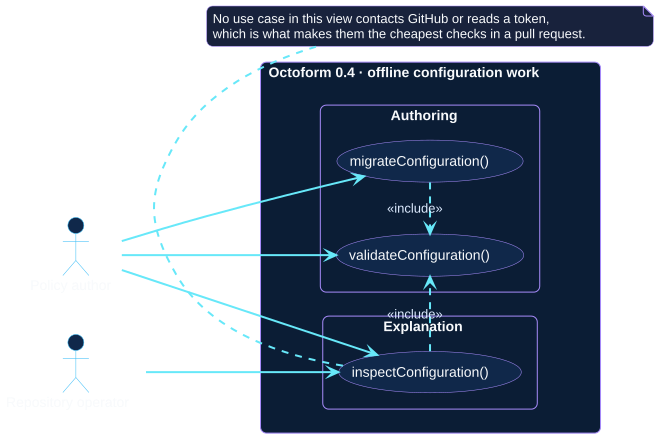
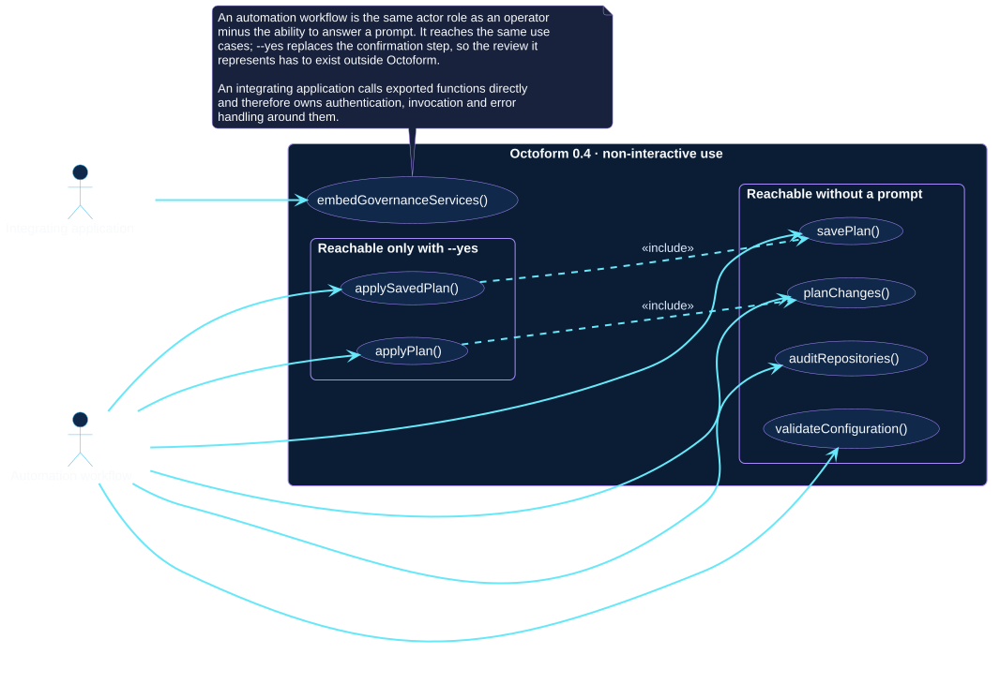

# Actors and use cases

These requirements views separate each user goal into one use case.
Relationships between cases make read-only prerequisites and explicit write
extensions visible instead of hiding them inside broad labels.

## Actors

| Actor | Responsibility and trust |
| --- | --- |
| Repository operator | Authors or reviews policy, chooses scope, interprets plans, and owns interactive confirmation. |
| CI/CD workflow | Executes a predefined command with repository, environment, and credential controls supplied by the automation platform. |
| TypeScript application | Calls supported ESM exports and therefore owns authentication, invocation boundaries, output, and error handling around them. |
| GitHub REST API | Supporting external actor and authority for owner identity, visible repositories, current state, permissions, capability evidence, and mutation results. It is shown in the context and structural views to keep primary goals readable here. |

## Interactive governance

[Open the PlantUML source](../../assets/diagrams/sources/actors-and-use-cases.puml)

## Automation and integration

[Open the PlantUML source](../../assets/diagrams/sources/automation-use-cases.puml)

## Interactive use cases

- **Audit repository metadata:** list inventory and read-only findings.
- **Preview desired-state changes:** compare resolved policy with observed state.
- **Confirm and apply a displayed plan:** include planning, then explicitly
  authorize executable changes from that invocation.
- **Propose missing repository types:** evaluate ordered classification rules.
- **Persist classification proposals:** extend proposal generation with an
  organization custom-property write.
- **Synchronize custom-property schema:** converge allowed type values and
  explicitly declared repository assignments.

## Automation use cases

- **Run scheduled observation:** include read-only audit in a recurring job.
- **Validate policy in a pull request:** include read-only planning against
  reviewed candidate configuration.
- **Run protected non-interactive apply:** include the apply workflow but move
  confirmation into branch and environment protections outside Octoform.

## Application use case

**Embed configuration and planning services** reuses exported TypeScript
building blocks. It does not turn a partial observation into a safe plan; the
consumer must still supply the complete inputs expected by the chosen export.

Use the [command reference](../../commands/index.md) for the exact CLI surface
and [automation patterns](../delivery/automation-patterns.md) for trust controls.
