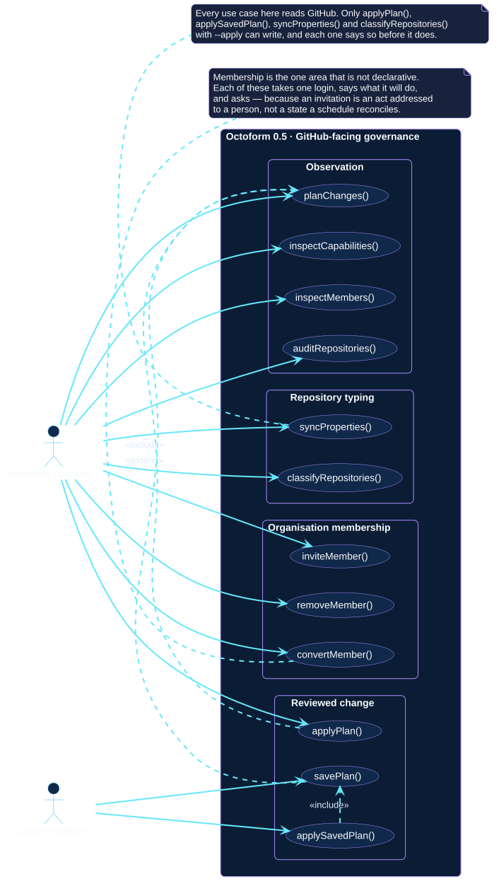

# Actors and use cases

An actor is a role, not a person. One human can be a policy author in the
morning and a change reviewer in the afternoon; separating the roles is what
makes it possible to say which authority each goal actually needs.

## Actor catalogue

| Actor | What the role does | Authority it needs |
| --- | --- | --- |
| Policy author | Writes and composes the configuration, and proves it loads before anyone spends a credential on it. | None. Every goal in this role is offline. |
| Repository operator | Chooses scope, interprets plans, and owns interactive confirmation. | A token whose reach is no broader than the operation. |
| Change reviewer | Approves a specific plan and hands it over, so that the approval and the execution are separable. | Read access to produce the plan; whoever applies it needs write access. |
| Automation workflow | Runs a predefined command with no ability to answer a prompt. | Whatever the platform grants it, bounded by branch and environment protections. |
| Integrating application | Calls the exported TypeScript functions directly. | Owns authentication, invocation, and error handling itself. |
| GitHub REST API | Supporting actor. The authority on account identity, visible repositories, current state, permissions, and the outcome of every mutation. | Not applicable; it is the system being governed. |

The GitHub REST API is a supporting actor rather than a primary one: it never
initiates anything. It appears in the [system context](system-context.md) and
in the structural views, and is left out of the goal diagrams below so the
goals stay readable.

## Offline configuration work

Nothing in this view contacts GitHub or reads a token, which is what makes
these the cheapest checks to put in front of a pull request.

[Open the PlantUML source](../../assets/diagrams/sources/actors-and-use-cases.puml)

`migrateConfiguration()` and `inspectConfiguration()` both include
`validateConfiguration()`, because neither can convert or explain a document
it has not first resolved.

## GitHub-facing governance

[Open the PlantUML source](../../assets/diagrams/sources/governance-use-cases.puml)

Two relationships carry the design of the release:

- `applyPlan()` **includes** `planChanges()`. Applying is never a separate
  mutation path; it plans again and shows the result first.
- `savePlan()` **extends** `planChanges()`. Saving is optional behaviour on
  top of planning, and `applySavedPlan()` includes it because a saved plan is
  its only possible input.

The membership package sits apart from both, and its three goals reach no
planning use case at all. That is the one place in the model where a write is
not preceded by a plan. It is argued in each specification, and summarised in
[`octoform members`](../../commands/members.md#why-these-are-commands-and-not-policy):
an invitation is addressed to a person who is emailed about it, and an
authoritative member list would remove somebody the first time a name was
mistyped.

Note what is *not* in that package. Everything the organization holds — its
profile, its member policies, its custom properties, its rulesets, its teams
and its roles — is reached through `planChanges()` like any repository setting,
because a change that reaches every repository an account owns should never be
the one thing nobody saw a diff for.

## Non-interactive use

[Open the PlantUML source](../../assets/diagrams/sources/automation-use-cases.puml)

An automation workflow is not given its own set of goals, because it does not
have any. It reaches the same use cases as an operator, minus the ability to
answer a prompt. `--yes` replaces the confirmation step, which means the review
that confirmation represented has to exist somewhere else: a reviewed workflow
revision, a protected environment, and narrow repository access. See
[automation patterns](../delivery/automation-patterns.md).

## Where each goal is specified

Every use case above has a specification that details its conversation and the
states it can end on. Start from the
[specification catalogue](use-cases/index.md), or from the
[operator context](operator-context.md) if you would rather navigate by what
you are holding.
