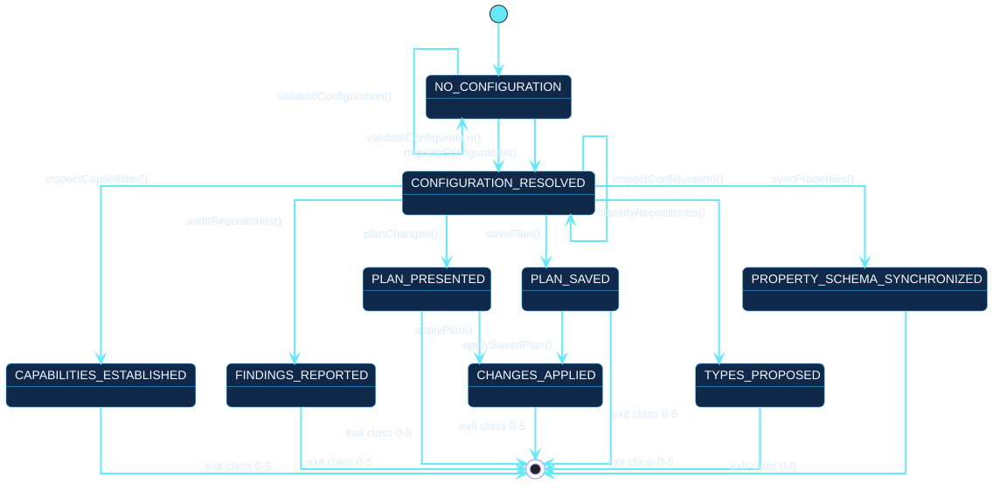

# Operator context

This is the model every use case is placed on. Each state is something the
operator holds; each transition is a use case with its own
[specification](use-cases/index.md).

[Open the PlantUML source](../../assets/diagrams/sources/operator-context.puml)

## States are held, not displayed

Octoform has no screens, so a state here is not a view. It is what the
operator has established and can act on.

| State | What the operator holds |
| --- | --- |
| `NO_CONFIGURATION` | Nothing has been resolved. A file may exist, but it has not been proven to load. |
| `CONFIGURATION_RESOLVED` | A document that composes, validates, and names its accounts. No GitHub state has been read. |
| `CAPABILITIES_ESTABLISHED` | Evidence of what each selected account is and supports. |
| `FINDINGS_REPORTED` | Audit findings against observed metadata, with no desired state declared for them. |
| `PLAN_PRESENTED` | A plan on screen, valid for the observation that produced it. |
| `PLAN_SAVED` | A plan as a file, carrying the identity it was produced under. |
| `CHANGES_APPLIED` | Per-operation outcomes. Not a guarantee that every operation succeeded. |
| `TYPES_PROPOSED` | Proposed repository types, written only when `--apply` was requested. |
| `PROPERTY_SCHEMA_SYNCHRONIZED` | An organization property schema converged with the declared types. |
| `MEMBERSHIP_REPORTED` | Who is in the organization, and which of the people the configuration names are not. |
| `MEMBERSHIP_CHANGED` | One person invited, removed, or converted. Never more than one. |

## Why most states are terminal

Almost every state leads to the final state rather than back to
`CONFIGURATION_RESOLVED`. That is the honest shape for a command-line tool:
the process exits, and nothing is retained between invocations except what was
written to disk.

Two transitions therefore matter more than the rest, because they are the only
ones that carry work forward:

- `planChanges()` to `applyPlan()` happens **inside one invocation**. `apply`
  plans again and shows the result before asking, because the state observed a
  moment earlier may have moved.
- `savePlan()` to `applySavedPlan()` happens **across invocations**, and it is
  possible only because the plan was persisted. This is the separation of
  duties introduced in 0.4: the reviewer and the applier need not be the same
  person or process.

Every other apparent continuation — planning, then applying tomorrow from
memory — is not modelled because Octoform does not support it. A plan that was
not saved cannot be applied later.

## `MEMBERSHIP_CHANGED` is deliberately outside the plan

Three transitions reach it, and none of them goes through `PLAN_PRESENTED`.
That is the one place in this model where a write is not preceded by a plan,
and it is a design decision rather than an omission: an invitation is an act
addressed to a person who is emailed about it, so it is confirmed one login at
a time rather than reconciled by a schedule. See
[`octoform members`](../../commands/members.md).

Everything the organization *itself* holds — its profile, its member policies,
its properties, rulesets, teams and roles — does go through
`PLAN_PRESENTED`, because a setting that reaches every repository an account
owns should never be the one thing nobody saw a diff for.

## Self-transitions are not idle

Three transitions return to the state they left, and each says something.

- `NO_CONFIGURATION` to itself on `validateConfiguration()`: the document did
  not load. The operator holds no more than before, and the command exits `2`.
- `CONFIGURATION_RESOLVED` to itself on `inspectConfiguration()`: the resolved
  shape is printed and nothing is established beyond it.
- `TYPES_PROPOSED` to itself on `classifyRepositories()`: re-running the
  proposal is safe, because proposing writes nothing.

## Traceability

Use this model as the index. Follow a transition to its specification for the
conversation inside it, and follow a specification's outgoing arrows back to
the state they land on here.

The transition to the final state is labelled with the exit class rather than
a use case, because ending is not a goal an actor pursues. The classes are
frozen for the whole `v0` line and are listed in the
[execution contract](../../commands/execution-contract.md).
