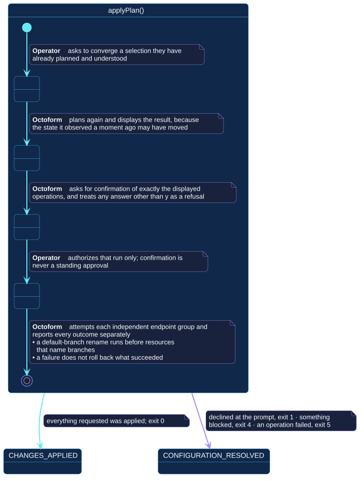

# `applyPlan()`

## Use-case information

| Attribute | Value |
| --- | --- |
| Name | `applyPlan()` |
| Primary actor | Repository operator |
| Goal | Converge a selection the operator has already planned and understood |
| Level | User goal |
| Type | Primary, essential |
| Precondition | A configuration resolves; a token with sufficient permission is available |
| Successful postcondition | Every executable operation was attempted and its outcome reported |
| Failure postcondition | Declined, blocked, or failed; what succeeded is not rolled back |
| Command | `octoform apply` |

## Specification diagram

[Open the PlantUML source](../../../assets/diagrams/sources/uc-apply-plan.puml)

## Detailed conversation

| Turn | Party | Exchange |
| --- | --- | --- |
| 1 | Repository operator | Asks to converge a selection they have already planned |
| 2 | Octoform | Plans again and displays the result, because the state observed a moment ago may have moved |
| 3 | Octoform | Asks for confirmation of exactly the displayed operations |
| 4 | Repository operator | Authorizes that run, or declines |
| 5 | Octoform | Attempts each independent endpoint group and reports every outcome separately |

## Confirmation is scoped to the run

Answering `y` authorizes the operations that were just displayed, for that
invocation. It is not a standing approval, and it does not carry to the next
run. Any answer other than `y` declines and exits without mutation.

`--yes` replaces the prompt, not the review. It belongs only in a path where
configuration review, plan retention, credential scope, and environment
approval already do the work the prompt was doing.

## Ordering and partial failure

Octoform groups settings that share a GitHub endpoint, so those settings
succeed or fail together in one request. A default-branch rename runs before
resources that name branches, so rulesets and created files target the
declared branch name.

Independent groups are attempted even when another group fails. A failure
therefore does not imply that everything was rolled back — there is no
rollback. Recovery is to plan again, observe the resulting state, and decide
from there.

## Internal states

| State | Description | Responsibility |
| --- | --- | --- |
| `RequestingApply` | The operator has asked to converge | Establish policy and selection |
| `Presenting` | A fresh plan is being displayed | Show what will be attempted now, not what was planned earlier |
| `Confirming` | Authorization is being requested | Treat anything but `y` as a refusal |
| `Executing` | Operations are being attempted | Report each outcome separately, and never claim an unattempted operation succeeded |

## Connection with the operator context

- `PLAN_PRESENTED` → `applyPlan()` → `CHANGES_APPLIED`
- `PLAN_PRESENTED` → `applyPlan()` → `CONFIGURATION_RESOLVED` when declined

This transition happens inside a single invocation: `applyPlan()` includes
`planChanges()`, which is why `PLAN_PRESENTED` is reached first. Exit `1` when
declined, `4` when something was blocked, `5` when an operation failed.

## Vocabulary

**Repository operator** asks, authorizes, declines.
**Octoform** plans, displays, asks, attempts, reports. It never applies
anything it did not display, and never retries on the operator's behalf.

## References

- [`octoform apply`](../../../commands/apply.md)
- [`planChanges()`](plan-changes.md), which this use case includes
- [Operate plan and apply safely](../../../guides/plan-and-apply.md)
