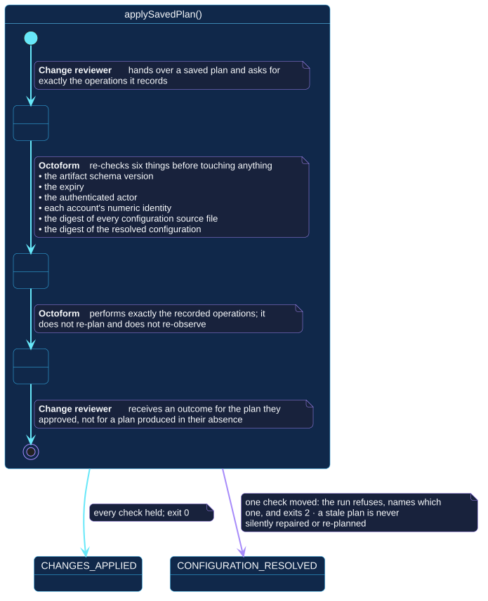

# `applySavedPlan()`

## Use-case information

| Attribute | Value |
| --- | --- |
| Name | `applySavedPlan()` |
| Primary actor | Change reviewer |
| Goal | Carry out exactly the plan that was approved, or refuse and say why |
| Level | User goal |
| Type | Primary, essential to the 0.4 release |
| Precondition | A saved plan exists; a token with sufficient permission is available |
| Successful postcondition | Every recorded operation was attempted and its outcome reported |
| Failure postcondition | Nothing is attempted; the failing check is named and the run exits `2` |
| Command | `octoform apply --plan <path>` |

## Specification diagram

[Open the PlantUML source](../../../assets/diagrams/sources/uc-apply-saved-plan.puml)

## Detailed conversation

| Turn | Party | Exchange |
| --- | --- | --- |
| 1 | Change reviewer | Hands over a saved plan and asks for exactly the operations it records |
| 2 | Octoform | Re-checks six things before touching anything |
| 3 | Octoform | Performs exactly the recorded operations, without re-planning and without re-observing |
| 4 | Change reviewer | Receives an outcome for the plan they approved |

## The six checks

| Check | What a failure means |
| --- | --- |
| Artifact schema version | The file was produced by an incompatible release |
| Expiry | The observation behind the plan is too old to act on |
| Authenticated actor | A different identity is applying than the one that planned |
| Account numeric identity | An account was renamed, replaced, or is not the one that was planned against |
| Configuration source digests | A contributing file changed after the plan was reviewed |
| Resolved configuration digest | The document means something different now, however it is written |

A failure names which check failed. The run refuses; a stale plan is never
silently repaired and never quietly re-planned into something else.

## Why refusing is the feature

The purpose of the artifact is that the second command cannot exceed the
first. If a check could be waived, the approval would no longer bound the
execution and the separation of duties would be decorative. Refusal is
therefore the correct outcome, not an inconvenience: it means the world moved
and the approval no longer describes it.

The remedy is always the same. Plan again, review the new plan, hand over the
new artifact.

## Internal states

| State | Description | Responsibility |
| --- | --- | --- |
| `PresentingArtifact` | The plan file has been supplied | Read it without trusting it |
| `Verifying` | Six checks are being run | Refuse on the first that does not hold, and name it |
| `Executing` | Recorded operations are being attempted | Perform exactly what is recorded, no more |

## Connection with the operator context

- `PLAN_SAVED` → `applySavedPlan()` → `CHANGES_APPLIED`
- `PLAN_SAVED` → `applySavedPlan()` → `CONFIGURATION_RESOLVED` when a check
  does not hold

This is the only transition in the context that crosses invocations, and the
artifact is what makes it possible.

## Vocabulary

**Change reviewer** hands over, receives.
**Octoform** verifies, refuses, performs, reports. It does not re-plan, does
not re-observe, and does not negotiate a failed check.

## References

- [`octoform apply`](../../../commands/apply.md)
- [`savePlan()`](save-plan.md), which this use case includes
- [Apply and verify](../../../getting-started/safe-apply.md)
