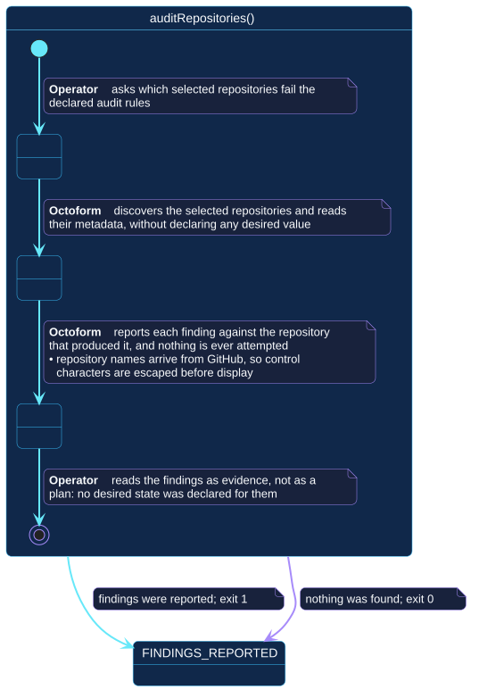

# `auditRepositories()`

## Use-case information

| Attribute | Value |
| --- | --- |
| Name | `auditRepositories()` |
| Primary actor | Repository operator |
| Goal | Learn which selected repositories fail the declared audit rules |
| Level | User goal |
| Type | Primary, essential |
| Precondition | A configuration resolves and declares audit rules; a token is available |
| Successful postcondition | Every finding is reported against the repository that produced it; nothing was attempted |
| Failure postcondition | Discovery or observation failed and is reported |
| Command | `octoform audit` |

## Specification diagram

[Open the PlantUML source](../../../assets/diagrams/sources/uc-audit-repositories.puml)

## Detailed conversation

| Turn | Party | Exchange |
| --- | --- | --- |
| 1 | Repository operator | Asks which selected repositories fail the declared audit rules |
| 2 | Octoform | Discovers the selection and reads repository metadata, declaring no desired value for any of it |
| 3 | Octoform | Reports each finding against the repository that produced it |
| 4 | Repository operator | Reads the findings as evidence, not as a plan |

## A finding is not a change

This is the distinction the use case exists to protect. An audit rule declares
what is worth reporting, not what a repository should be. Nothing an audit
produces is ever passed to an applier, and no audit finding appears in a plan
unless a policy separately declares a desired value for that field.

## Untrusted input is escaped before display

Repository names, descriptions, and topics arrive from GitHub and are
controlled by whoever can edit them. Control characters in those values are
escaped before they reach a terminal, so a crafted repository name cannot
rewrite the report around it.

## Internal states

| State | Description | Responsibility |
| --- | --- | --- |
| `RequestingAudit` | The operator has asked, nothing has been read | Establish the selection |
| `Observing` | Repository metadata is being read | Read only what the declared rules are about |
| `Reporting` | Findings are being presented | Attribute every finding to its repository, and escape values GitHub controls |

## Connection with the operator context

- `CONFIGURATION_RESOLVED` → `auditRepositories()` → `FINDINGS_REPORTED`

The state is reached whether or not anything was found. What differs is the
exit class: findings exit `1`, a clean audit exits `0`.

!!! warning "This changed in 0.4"

    In the 0.3 line an audit with findings exited `0`. It now exits `1`, so
    drift gates a job directly. A pipeline that must not fail on findings has
    to handle that class deliberately.

## Vocabulary

**Repository operator** asks, reads, decides what to do about it.
**Octoform** discovers, observes, reports. It does not propose a remedy,
because no desired value was declared.

## References

- [`octoform audit`](../../../commands/audit.md)
- [Classification and audit](../../../configuration/classification-and-audit.md)
- [Authentication and exit codes](../../../commands/execution-contract.md)
