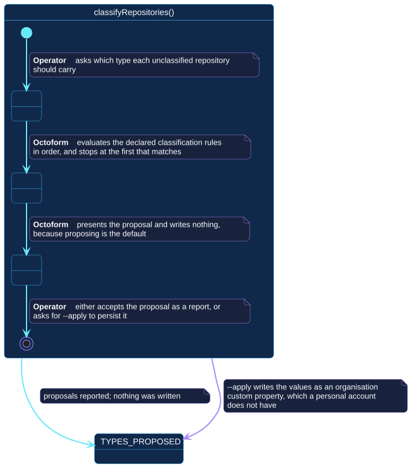

# `classifyRepositories()`

## Use-case information

| Attribute | Value |
| --- | --- |
| Name | `classifyRepositories()` |
| Primary actor | Repository operator |
| Goal | Learn which type each unclassified repository should carry, and optionally persist it |
| Level | User goal |
| Type | Primary, essential |
| Precondition | A configuration resolves and declares classification rules; a token is available |
| Successful postcondition | A proposal is reported; with `--apply`, accepted values are written as an organization custom property |
| Failure postcondition | Nothing is written; the reason is reported |
| Command | `octoform classify` |

## Specification diagram

[Open the PlantUML source](../../../assets/diagrams/sources/uc-classify-repositories.puml)

## Detailed conversation

| Turn | Party | Exchange |
| --- | --- | --- |
| 1 | Repository operator | Asks which type each unclassified repository should carry |
| 2 | Octoform | Evaluates the declared classification rules in order and stops at the first that matches |
| 3 | Octoform | Presents the proposal and writes nothing, because proposing is the default |
| 4 | Repository operator | Accepts the proposal as a report, or asks for `--apply` to persist it |

## Order is part of the requirement

Rules are evaluated in declaration order and the first match wins. That makes
the order of the rules a decision the author is making, whether or not they
intend to: moving a broad rule above a narrow one silently changes what the
narrow one classifies. The proposal is reported before anything is written
precisely so that this is visible.

## The alternate flow is account-shaped

`--apply` writes the value as an organization custom property. A personal
account does not have organization custom properties, so this alternate flow
does not exist there. That is reported as an inapplicable declaration by
[`inspectCapabilities()`](inspect-capabilities.md) rather than discovered as a
failure mid-run.

A personal account can still be classified from local evidence and still use
repository rulesets; only the persistence step is unavailable.

## Internal states

| State | Description | Responsibility |
| --- | --- | --- |
| `RequestingProposal` | The operator has asked for types | Establish the selection |
| `Evaluating` | Rules are being applied in order | Stop at the first match, and make the winning rule attributable |
| `Proposing` | The proposal is being presented | Write nothing unless persistence was explicitly requested |

## Connection with the operator context

- `CONFIGURATION_RESOLVED` → `classifyRepositories()` → `TYPES_PROPOSED`
- `TYPES_PROPOSED` → `classifyRepositories()` → `TYPES_PROPOSED`

The self-transition is meaningful: re-running the proposal is safe because
proposing writes nothing.

## Vocabulary

**Repository operator** asks, accepts, persists.
**Octoform** evaluates, proposes, writes only when asked. It never infers that
a proposal should be persisted because it was produced.

## References

- [`octoform classify`](../../../commands/classify.md)
- [Classification and audit](../../../configuration/classification-and-audit.md)
- [`syncProperties()`](sync-properties.md)
