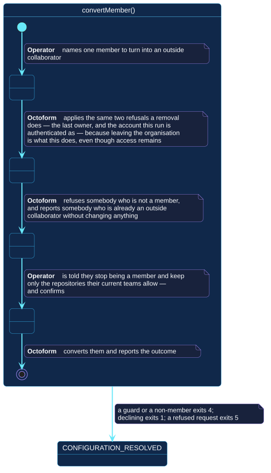

# `convertMember()`

## Use-case information

| Attribute | Value |
| --- | --- |
| Name | `convertMember()` |
| Primary actor | Repository operator |
| Goal | Turn one named member into an outside collaborator |
| Level | User goal |
| Type | Secondary |
| Precondition | The selected account is an organization; the named person is a member; the token can administer its membership |
| Successful postcondition | Exactly one membership was converted, and what the person keeps was stated |
| Failure postcondition | Nothing was converted, and the reason is a guard, a non-member, or GitHub's refusal |
| Command | `octoform members convert --user <login>` |

## Specification diagram

[Open the PlantUML source](../../../assets/diagrams/sources/uc-convert-member.puml)

## Detailed conversation

| Turn | Party | Exchange |
| --- | --- | --- |
| 1 | Repository operator | Names one member |
| 2 | Octoform | Applies the same two refusals a removal does |
| 3 | Octoform | Refuses somebody who is not a member, and reports somebody who is already an outside collaborator without changing anything |
| 4 | Octoform | States that they stop being a member and keep only the repositories their current teams allow |
| 5 | Repository operator | Confirms |
| 6 | Octoform | Converts them and reports the outcome |

## A narrowing that is still a departure

Converting is not removing: the person keeps the repositories their current
teams give them. But they do leave the organization, and everything that
follows from membership goes with it.

So it is guarded exactly like a removal, by the same two refusals — the only
remaining owner, and the account the run is authenticated as. Treating it as a
softer operation because the outcome sounds softer would put the same lockout
one command away.

## Two states that are not failures

- **Already an outside collaborator.** Reported, exit `0`, nothing changed.
- **Not a member at all.** Refused, exit `4`: there is no membership to
  convert, and inventing one by inviting them would not be what was asked for.

## Internal states

| State | Description | Responsibility |
| --- | --- | --- |
| `NamingOnePerson` | One login has been supplied | Establish that the account is an organization |
| `Guarding` | The two refusals are being checked | Apply a removal's guards to an operation that is not a removal |
| `Asking` | The consequence has been stated | Say precisely what survives the conversion |
| `Converting` | The request is being sent | Report the outcome |

## Connection with the operator context

- `CONFIGURATION_RESOLVED` → `convertMember()` → `MEMBERSHIP_CHANGED`
- `CONFIGURATION_RESOLVED` → `convertMember()` → `CONFIGURATION_RESOLVED` when
  a guard refuses it, the person is not a member, or the confirmation is
  declined

## Vocabulary

**Repository operator** names, confirms.
**Octoform** refuses, states, asks, converts, reports. It never converts more
than one person, and never one whose departure would leave the organization
with nobody able to administer it.

## References

- [`octoform members`](../../../commands/members.md)
- [`removeMember()`](remove-member.md)
