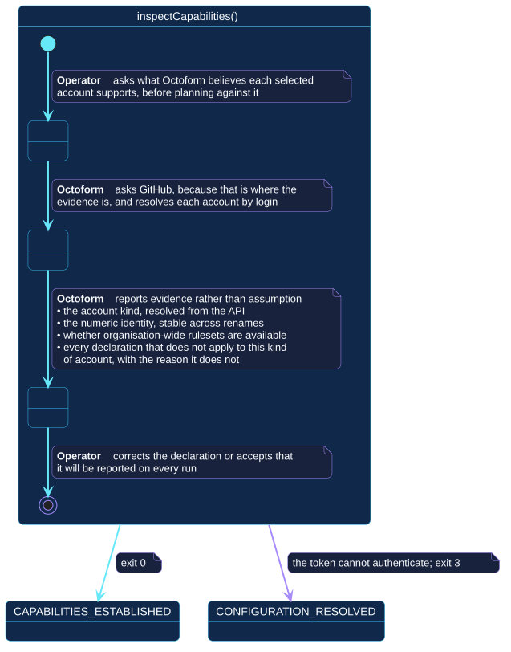

# `inspectCapabilities()`

## Use-case information

| Attribute | Value |
| --- | --- |
| Name | `inspectCapabilities()` |
| Primary actor | Repository operator |
| Goal | Learn what each selected account is and supports, with evidence, before planning against it |
| Level | User goal |
| Type | Primary, essential |
| Precondition | A configuration resolves, and a token is available |
| Successful postcondition | Each account's kind, identity, ruleset availability, and inapplicable declarations are known |
| Failure postcondition | Nothing is established; a configuration error exits `2`, an authentication failure exits `3` |
| Command | `octoform inspect capabilities` |

## Specification diagram

[Open the PlantUML source](../../../assets/diagrams/sources/uc-inspect-capabilities.puml)

## Detailed conversation

| Turn | Party | Exchange |
| --- | --- | --- |
| 1 | Repository operator | Asks what Octoform believes each selected account supports |
| 2 | Octoform | Asks GitHub, because that is where the evidence is, and resolves each account by login |
| 3 | Octoform | Reports the account kind, its numeric identity, whether organization-wide rulesets are available, and every declaration that does not apply to this kind of account, each with its reason |
| 4 | Repository operator | Corrects the declaration, or accepts that it will be reported on every run |

## Evidence, not assumption

Every line this use case produces is an observation:

- the **account kind** is resolved from the API, not inferred from how the
  configuration is written;
- the **numeric identity** is stable across renames, and is what a
  [saved plan](save-plan.md) verifies against;
- **ruleset availability** is reported as available, unavailable, or unknown,
  and unknown is never treated as available;
- an **inapplicable declaration** is reported with the reason it does not
  apply, and is never silently ignored.

A capability check does not grant permission, and does not infer authorization
from a commercial plan name.

## Internal states

| State | Description | Responsibility |
| --- | --- | --- |
| `RequestingEvidence` | The operator has asked, nothing has been read | Establish the selection before spending a request |
| `Resolving` | Accounts are being resolved by login | Treat the API as the authority on what each account is |
| `Presenting` | Evidence is being reported | State the reason behind every answer, so the operator can disagree with it |

## Connection with the operator context

- `CONFIGURATION_RESOLVED` → `inspectCapabilities()` → `CAPABILITIES_ESTABLISHED`
- `CONFIGURATION_RESOLVED` → `inspectCapabilities()` → `CONFIGURATION_RESOLVED`
  when the token cannot authenticate

This is the first use case in the context that leaves the offline region, and
therefore the first that can fail with exit `3`.

## Vocabulary

**Repository operator** asks, corrects, accepts.
**Octoform** resolves, observes, reports. It never assumes an account kind and
never converts an unknown into a yes.

## References

- [`octoform inspect`](../../../commands/inspect.md)
- [Authentication and exit codes](../../../commands/execution-contract.md)
- [`planChanges()`](plan-changes.md)
