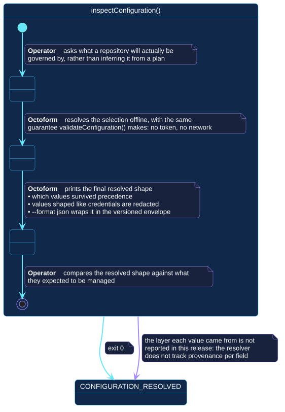

# `inspectConfiguration()`

## Use-case information

| Attribute | Value |
| --- | --- |
| Name | `inspectConfiguration()` |
| Primary actor | Repository operator |
| Goal | See what a selection will actually be governed by, without inferring it from a plan |
| Level | User goal |
| Type | Primary, essential |
| Precondition | A configuration file exists and resolves |
| Successful postcondition | The final resolved shape has been presented, with credential-shaped values redacted |
| Failure postcondition | Nothing is presented; a configuration or selector error is reported |
| Command | `octoform inspect config` |

## Specification diagram

[Open the PlantUML source](../../../assets/diagrams/sources/uc-inspect-configuration.puml)

## Detailed conversation

| Turn | Party | Exchange |
| --- | --- | --- |
| 1 | Repository operator | Asks what a repository will actually be governed by |
| 2 | Octoform | Resolves the selection offline, with the same guarantee `validateConfiguration()` makes: no token, no network |
| 3 | Octoform | Prints the final resolved shape, redacting credential-shaped values, optionally wrapped in the versioned JSON envelope |
| 4 | Repository operator | Compares the resolved shape against what they expected to be managed |

## What this use case deliberately does not answer

It shows the final resolved shape only. Which layer contributed each value —
root defaults, an account's own defaults, a type, a repository entry — is not
reported in this release, because the resolver does not track provenance per
field.

That limit is recorded here rather than hidden, because it changes how the use
case is used. It answers "what will apply?" but not "why did this win?". For
the second question, read
[selection and precedence](../../../configuration/selection-and-precedence.md)
and trace the layers by hand.

## Internal states

| State | Description | Responsibility |
| --- | --- | --- |
| `RequestingResolved` | The operator has asked for the resolved view | Accept a selection without contacting anything |
| `Resolving` | Layers are being folded in | Produce exactly the shape a GitHub-facing command would use |
| `Presenting` | The result is being shown | Redact anything shaped like a credential before it reaches a terminal or a log |

## Connection with the operator context

- `CONFIGURATION_RESOLVED` → `inspectConfiguration()` → `CONFIGURATION_RESOLVED`

The self-transition is accurate: the operator learns something but holds
nothing new. No GitHub state was read, so no capability, repository, or
identity has been established.

## Vocabulary

**Repository operator** asks, compares.
**Octoform** resolves, redacts, presents. It reports a shape, never a
recommendation about that shape.

## References

- [`octoform inspect`](../../../commands/inspect.md)
- [Selection and precedence](../../../configuration/selection-and-precedence.md)
- [Credentials and permissions](../../../security/credentials-and-permissions.md)
