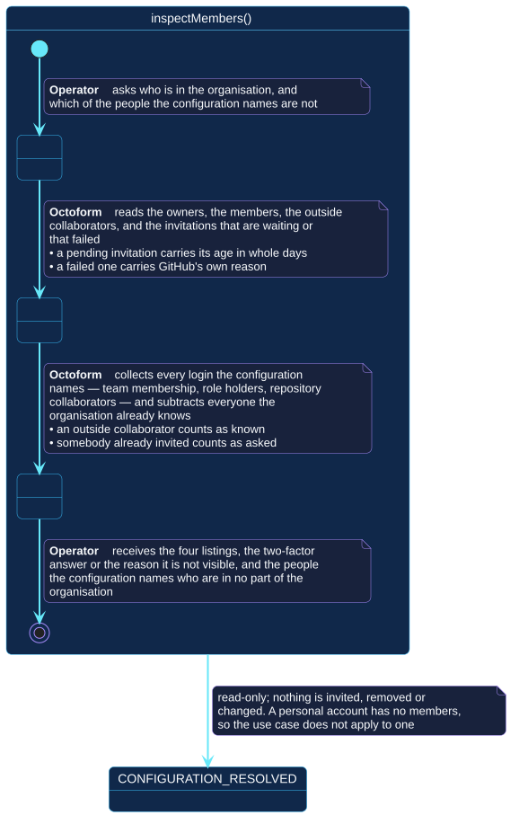

# `inspectMembers()`

## Use-case information

| Attribute | Value |
| --- | --- |
| Name | `inspectMembers()` |
| Primary actor | Repository operator |
| Goal | Know who is in the organization, and which of the people the configuration names are not |
| Level | User goal |
| Type | Secondary |
| Precondition | The selected account is an organization; the token can read its membership |
| Successful postcondition | The four listings and the comparison are reported; nothing is changed |
| Failure postcondition | The reason is reported; no listing is presented as complete when it was not |
| Command | `octoform inspect members` |

## Specification diagram

[Open the PlantUML source](../../../assets/diagrams/sources/uc-inspect-members.puml)

## Detailed conversation

| Turn | Party | Exchange |
| --- | --- | --- |
| 1 | Repository operator | Asks who is in the organization, and which of the people the configuration names are not |
| 2 | Octoform | Reads the owners, the members, the outside collaborators, and the invitations that are waiting or that failed |
| 3 | Octoform | Collects every login the configuration names, with the paths that name them, and subtracts everyone the organization already knows |
| 4 | Repository operator | Receives the listings, the two-factor answer or the reason it is not visible, and the people who are in no part of the organization |

## The listings are not the point

Every listing here is something GitHub will show anybody with access. What a
configuration file adds is the question neither side can answer alone: **of the
people this file grants things to, which ones are not in the organization at
all?**

Those are the grants that will turn into invitations. An invitation nobody
accepts is access that never arrives while the file goes on claiming it does.

## What counts as known

An outside collaborator counts. Having repository access without being a member
is a legitimate arrangement, not an omission.

Somebody already invited counts. They have been asked, and asking again is not
the finding.

## An absence that is not an answer

GitHub answers the two-factor filter only for an organization owner. When the
token is not one, the report says so rather than listing nobody: an empty list
would read as "everybody has it enabled", which is a different statement and
may be untrue.

This is the same discipline that separates unreadable from `null` everywhere
else in the product, applied to a listing rather than to a field.

## Internal states

| State | Description | Responsibility |
| --- | --- | --- |
| `RequestingInventory` | The operator has asked | Establish the selection and that the account is an organization |
| `Listing` | The organization's people are being read | Report each listing as read, and never present a partial one as complete |
| `Comparing` | The configuration's names are being checked against them | Say where each name came from, not only that it appeared |

## Connection with the operator context

- `CONFIGURATION_RESOLVED` → `inspectMembers()` → `MEMBERSHIP_REPORTED`
- `CONFIGURATION_RESOLVED` → `inspectMembers()` → `CONFIGURATION_RESOLVED` when
  the account is personal, or a listing cannot be read

## Vocabulary

**Repository operator** asks, receives.
**Octoform** reads, compares, reports. It invites nobody, and changes nothing.

## References

- [`octoform members`](../../../commands/members.md)
- [Teams and membership](../../../configuration/teams.md)
- [Repository access](../../../configuration/access.md)
