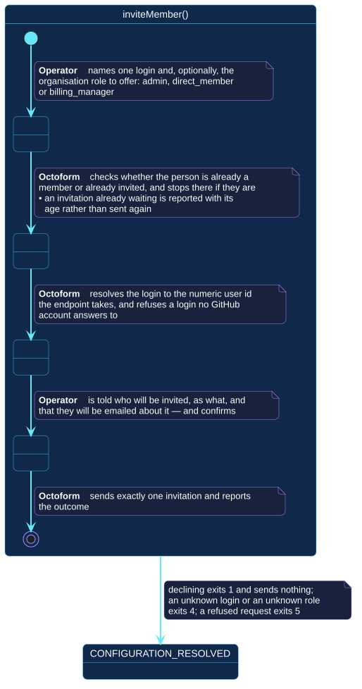

# `inviteMember()`

## Use-case information

| Attribute | Value |
| --- | --- |
| Name | `inviteMember()` |
| Primary actor | Repository operator |
| Goal | Invite one named person to the organization |
| Level | User goal |
| Type | Secondary |
| Precondition | The selected account is an organization; the token can administer its membership |
| Successful postcondition | Exactly one invitation was sent, or the person was already a member or already invited |
| Failure postcondition | Nothing was sent, and the reason names the login, the role, or GitHub's refusal |
| Command | `octoform members invite --user <login> [--role <role>]` |

## Specification diagram

[Open the PlantUML source](../../../assets/diagrams/sources/uc-invite-member.puml)

## Detailed conversation

| Turn | Party | Exchange |
| --- | --- | --- |
| 1 | Repository operator | Names one login, and optionally the organization role to offer |
| 2 | Octoform | Reports and stops when the person is already a member, or when an invitation to them is already waiting |
| 3 | Octoform | Resolves the login to the user id the endpoint takes, and refuses a login no account answers to |
| 4 | Octoform | States who will be invited, as what, and that they will be emailed about it |
| 5 | Repository operator | Confirms |
| 6 | Octoform | Sends exactly one invitation and reports the outcome |

## Why this is a command and not a policy

An invitation is an act addressed to a person, who is then emailed about it. A
file that listed members authoritatively would remove somebody the first time a
name was mistyped, and would send an invitation because a schedule fired rather
than because anybody decided to.

GitHub's own note on the endpoint — that inviting people too quickly runs into
secondary rate limiting — is the API agreeing that this is not a bulk
reconciliation operation.

## The login is resolved first

The invitation endpoint takes a numeric user id or an email address. It does
not take a login. So the login has to be resolved, and refusing one that
resolves to nothing costs one request and prevents inviting a stranger by a
name nobody checked.

## Idempotence without a plan

There is no diff here, so the two "already done" states carry it instead:

- Already a member: reported, exit `0`, nothing sent.
- Already invited: reported **with how long they have been waiting**, exit `0`,
  nothing sent. A second invitation is not what a stale one needs.

## Internal states

| State | Description | Responsibility |
| --- | --- | --- |
| `NamingOnePerson` | One login and one role have been supplied | Reject a role that is not one of the three GitHub accepts |
| `Resolving` | The organization's people and the login are being checked | Stop, successfully, when there is nothing to send |
| `Asking` | The consequence has been stated | Say that the person will be emailed, before asking |
| `Sending` | The invitation is being sent | Send one, and report what GitHub said |

## Connection with the operator context

- `CONFIGURATION_RESOLVED` → `inviteMember()` → `MEMBERSHIP_CHANGED`
- `CONFIGURATION_RESOLVED` → `inviteMember()` → `CONFIGURATION_RESOLVED` when
  the confirmation is declined, the login or role is refused, or GitHub refuses
  the request

## Vocabulary

**Repository operator** names, confirms.
**Octoform** checks, resolves, states, asks, sends, reports. It never invites
more than one person, and never without asking.

## References

- [`octoform members`](../../../commands/members.md)
- [`inspectMembers()`](inspect-members.md)
