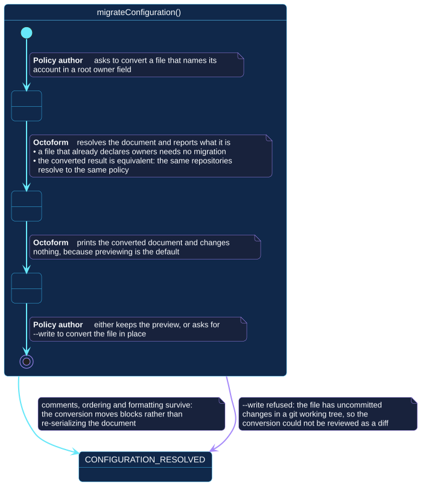

# `migrateConfiguration()`

## Use-case information

| Attribute | Value |
| --- | --- |
| Name | `migrateConfiguration()` |
| Primary actor | Policy author |
| Goal | Convert a document that names its account in a root `owner` field into the `owners` shape, as a reviewable diff |
| Level | User goal |
| Type | Secondary, optional |
| Precondition | A configuration file exists, resolves, and no file it imports binds policy to bare repository names at its own root |
| Successful postcondition | The converted document has been shown, or written in place with comments and ordering preserved |
| Failure postcondition | Nothing is written; the reason is reported, naming any file that has to move first |
| Command | `octoform config migrate` |

## Specification diagram

[Open the PlantUML source](../../../assets/diagrams/sources/uc-migrate-configuration.puml)

## Detailed conversation

| Turn | Party | Exchange |
| --- | --- | --- |
| 1 | Policy author | Asks to convert a file that names its account in a root `owner` field |
| 2 | Octoform | Resolves the document and reports what it is; a file that already declares `owners` needs no migration and is reported as such |
| 3 | Octoform | Checks what the imports declare, because only the named file is converted |
| 4 | Octoform | Prints the converted document and changes nothing, because previewing is the default |
| 5 | Policy author | Keeps the preview, or asks for `--write` |
| 6 | Octoform | Moves the blocks in place, preserving comments, ordering, and formatting |

## Why turn 3 exists

Only the file the author names is converted. A `repos` block at the root of an
imported file therefore stays where it is — and that block is accepted beside
`owner` while rejected beside `owners`, because a bare repository name
identifies nothing once more than one account can be in scope.

Converting the root alone would produce a document that no longer loads, so the
use case refuses and names the files that have to move first. It does not
rewrite them: the author offered one file, and silently editing others would
exceed what was asked.

Imports that keep repositories out of their root — declaring `types`,
`classify`, `audit` or `defaults` instead — are unaffected.

!!! info "Available since 0.4.1"

    In `0.4.0` this turn did not exist, and the conversion produced a file that
    failed to load on the next command.

## Why previewing is the default

The conversion rewrites a file the author is expected to keep under version
control. Defaulting to a preview means the destructive form has to be asked
for, and the tool refuses `--write` when the file has uncommitted changes in a
git working tree — so the conversion is always reviewable as a diff against a
known state.

## Why migration is optional

A single-owner file keeps its exact meaning in this release and produces the
same plans. The conversion is offered because the multi-owner shape is where
the rest of the release's features live, not because the old shape has been
deprecated.

## Internal states

| State | Description | Responsibility |
| --- | --- | --- |
| `RequestingConversion` | The author has asked, nothing has been read | Establish whether conversion applies at all |
| `Previewing` | The converted document is being presented | Show the whole result, write nothing |
| `Deciding` | The author is choosing whether to commit to it | Leave the decision with the author |

## Connection with the operator context

- `NO_CONFIGURATION` → `migrateConfiguration()` → `CONFIGURATION_RESOLVED`

The use case includes `validateConfiguration()`: a document that does not
resolve cannot be converted, because the conversion has to know what it means.

## Vocabulary

**Policy author** asks, reviews, commits.
**Octoform** resolves, reports, previews, converts. It moves blocks; it does
not re-serialize, because re-serializing would discard the comments that make
a configuration reviewable.

## References

- [`octoform config`](../../../commands/config.md)
- [Document composition](../../../configuration/document-composition.md)
- [`validateConfiguration()`](validate-configuration.md)
