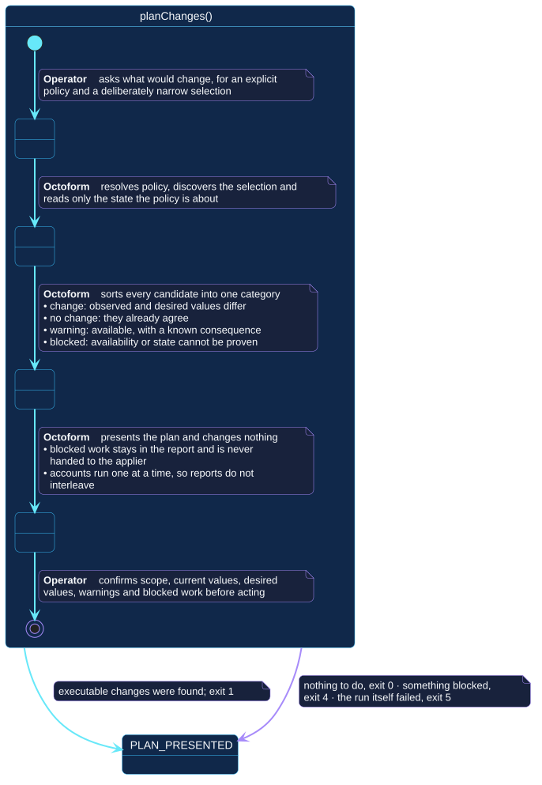

# `planChanges()`

## Use-case information

| Attribute | Value |
| --- | --- |
| Name | `planChanges()` |
| Primary actor | Repository operator |
| Goal | Learn what would change, for an explicit policy and a deliberately narrow selection |
| Level | User goal |
| Type | Primary, essential |
| Precondition | A configuration resolves; a token is available |
| Successful postcondition | Every candidate is sorted into exactly one category and presented; GitHub is unchanged |
| Failure postcondition | Discovery or observation failed; the run reports it and applies nothing |
| Command | `octoform plan` |

## Specification diagram

[Open the PlantUML source](../../../assets/diagrams/sources/uc-plan-changes.puml)

## Detailed conversation

| Turn | Party | Exchange |
| --- | --- | --- |
| 1 | Repository operator | Asks what would change, for an explicit policy and a narrow selection |
| 2 | Octoform | Resolves policy, discovers the selection, and reads only the state the policy is about |
| 3 | Octoform | Sorts every candidate into one of four categories |
| 4 | Octoform | Presents the plan and changes nothing |
| 5 | Repository operator | Confirms scope, current values, desired values, warnings, and blocked work before acting |

## The four categories

| Category | Meaning | What the operator does |
| --- | --- | --- |
| Change | Observed and desired values differ | Confirm repository, field, current value, and desired value |
| No change | They already agree | Nothing |
| Warning | The change is available but has a known consequence | Resolve or explicitly accept the consequence |
| Blocked | Availability or current state cannot be proven | Correct access, applicability, or policy, then plan again |

Blocked work stays in the report. It is never removed, never counted as
convergence, and never handed to the applier.

!!! info "Available since 0.4.1"

    The per-account counts are exclusive so they sum to the number scanned,
    which files a repository that is both changed and blocked under `changed`.
    The number of repositories carrying blocked work is therefore stated
    alongside the totals, so the summary cannot understate what the plan
    cannot apply. See [reading the summary](../../../commands/plan.md#reading-the-summary).

## Reading order across accounts

When a configuration declares several accounts, they run one at a time in
declaration order, so their reports never interleave. A failure in one does not
stop the rest by default; `--fail-fast` stops at the first. The run's exit
class is the most severe any account produced.

## Internal states

| State | Description | Responsibility |
| --- | --- | --- |
| `RequestingPlan` | The operator has asked, nothing has been read | Establish policy and selection before spending a request |
| `Observing` | GitHub state is being read | Read only the state the policy is about |
| `Classifying` | Candidates are being sorted | Put every candidate in exactly one category, and never leave one uncategorised |
| `Presenting` | The plan is being shown | Show blocked work as part of the plan, not as an aside |

## Connection with the operator context

- `CONFIGURATION_RESOLVED` → `planChanges()` → `PLAN_PRESENTED`

The exit class distinguishes what was found: `0` when nothing needs doing, `1`
when executable changes were found, `4` when something was blocked, `5` when
the run itself failed.

## Vocabulary

**Repository operator** asks, confirms, narrows.
**Octoform** resolves, observes, classifies, presents. It never attempts and
never silently drops a candidate it could not categorise.

## References

- [`octoform plan`](../../../commands/plan.md)
- [`savePlan()`](save-plan.md) for the reviewable artifact
- [`applyPlan()`](apply-plan.md), which includes this use case
