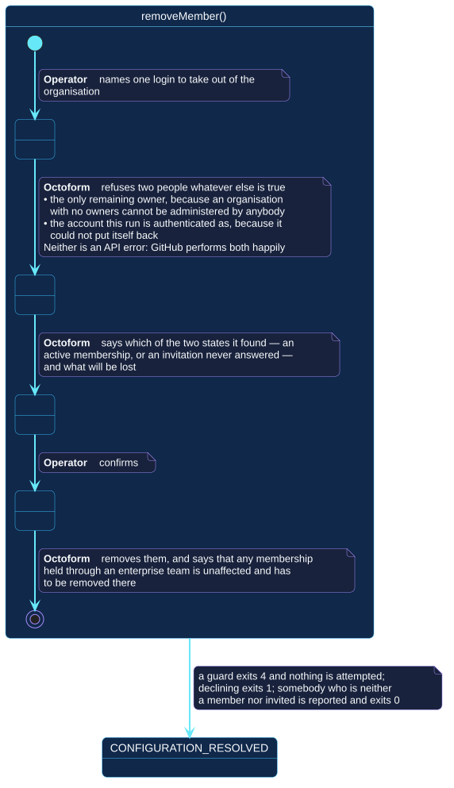

# `removeMember()`

## Use-case information

| Attribute | Value |
| --- | --- |
| Name | `removeMember()` |
| Primary actor | Repository operator |
| Goal | Take one named person out of the organization |
| Level | User goal |
| Type | Secondary |
| Precondition | The selected account is an organization; the token can administer its membership |
| Successful postcondition | Exactly one membership was removed or one invitation withdrawn, and what survives it was stated |
| Failure postcondition | Nothing was removed, and the reason is either a guard or GitHub's refusal |
| Command | `octoform members remove --user <login>` |

## Specification diagram

[Open the PlantUML source](../../../assets/diagrams/sources/uc-remove-member.puml)

## Detailed conversation

| Turn | Party | Exchange |
| --- | --- | --- |
| 1 | Repository operator | Names one login |
| 2 | Octoform | Refuses the only remaining owner, and refuses the account this run is authenticated as |
| 3 | Octoform | States which of the two states it found — an active membership or an unanswered invitation — and what will be lost |
| 4 | Repository operator | Confirms |
| 5 | Octoform | Removes them, and states that any membership held through an enterprise team is unaffected |

## The two guards

Both are about leaving nobody able to undo the change.

**The only remaining owner.** An organization with no owners cannot be
administered by anybody, including the people trying to fix it.

**The account this run is authenticated as.** It could not put itself back,
whatever it was allowed to do a moment earlier.

Neither is an API error. GitHub performs both happily, which is exactly why
they are decisions taken here rather than failures reported back. The same two
guards protect an authoritative
[team membership](../../../configuration/teams.md#authoritative-and-its-two-guards)
and an authoritative [role](../../../configuration/roles.md).

## One endpoint, two states

GitHub removes an active member and cancels a pending invitation through the
same request, and emails the person either way. So the command does not need to
know which case it is in — but the operator does, which is why it says so
before it asks.

## What the request does not do

Membership held through an enterprise team survives this. The request looks
like it did more than it did, so that is stated afterwards rather than left for
somebody to discover.

## Internal states

| State | Description | Responsibility |
| --- | --- | --- |
| `NamingOnePerson` | One login has been supplied | Establish that the account is an organization |
| `Guarding` | The two refusals are being checked | Refuse before anything is stated as about to happen |
| `Asking` | The consequence has been stated | Distinguish a removal from a withdrawal, and say what is lost |
| `Removing` | The request is being sent | Report the outcome, and what it did not reach |

## Connection with the operator context

- `CONFIGURATION_RESOLVED` → `removeMember()` → `MEMBERSHIP_CHANGED`
- `CONFIGURATION_RESOLVED` → `removeMember()` → `CONFIGURATION_RESOLVED` when a
  guard refuses it, the confirmation is declined, or the person is neither a
  member nor invited

## Vocabulary

**Repository operator** names, confirms.
**Octoform** refuses, states, asks, removes, reports. It never removes more
than one person, and never one that would leave the organization with nobody
able to administer it.

## References

- [`octoform members`](../../../commands/members.md)
- [`convertMember()`](convert-member.md)
- [Incidents and recovery](../../../security/incidents-and-recovery.md)
