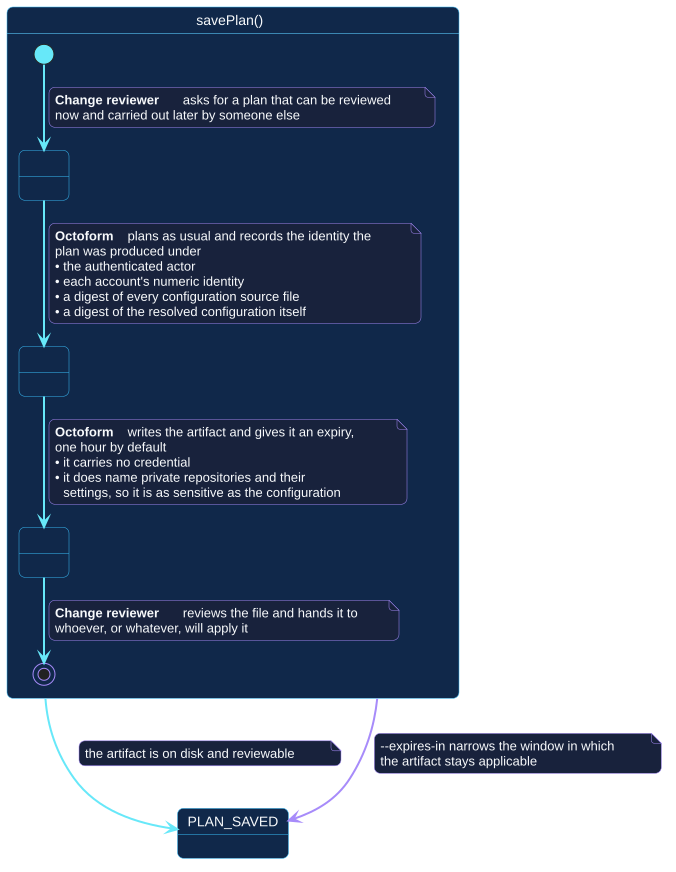

# `savePlan()`

## Use-case information

| Attribute | Value |
| --- | --- |
| Name | `savePlan()` |
| Primary actor | Change reviewer |
| Goal | Turn a reviewed plan into an artifact that someone else, or something else, can carry out unchanged |
| Level | User goal |
| Type | Primary, essential to the 0.4 release |
| Precondition | A plan can be produced for the selection |
| Successful postcondition | An artifact exists on disk recording the operations and the identity they were produced under |
| Failure postcondition | No artifact is written |
| Command | `octoform plan --out <path>` |

## Specification diagram

[Open the PlantUML source](../../../assets/diagrams/sources/uc-save-plan.puml)

## Detailed conversation

| Turn | Party | Exchange |
| --- | --- | --- |
| 1 | Change reviewer | Asks for a plan that can be reviewed now and carried out later |
| 2 | Octoform | Plans as usual, then records the identity the plan was produced under |
| 3 | Octoform | Writes the artifact and gives it an expiry, one hour by default |
| 4 | Change reviewer | Reviews the file and hands it to whoever, or whatever, will apply it |

## What the artifact records

Four things, each of which [`applySavedPlan()`](apply-saved-plan.md) will
re-check before acting:

- the **authenticated actor** the plan was produced as;
- each account's **numeric identity**, which is stable across renames;
- a **digest of every configuration source file** that contributed;
- a **digest of the resolved configuration** itself, computed over a
  canonical form so that reordering keys is not treated as a change.

Recording both digests is deliberate. The source digest catches an edited
file; the structural digest catches a document that was rewritten to look
different while meaning the same, or the reverse.

## Why the problem is worth an artifact

Planning and applying separately means two observations and two plans, and
nothing forces them to agree. The gap between them is where an unreviewed
change gets in. The artifact closes it by making the second command refuse
anything the first did not describe.

## Handling

The artifact carries no credential. It does name private repositories and
their settings, so it deserves the same care as the configuration: it is not
a build log attachment.

The expiry exists because a plan describes an observation, and observations
go stale. `--expires-in <minutes>` narrows the window.

## Internal states

| State | Description | Responsibility |
| --- | --- | --- |
| `RequestingArtifact` | The reviewer has asked for a durable plan | Accept a destination and an optional expiry |
| `Recording` | Identity is being captured alongside the operations | Record enough to detect a moved world later, and no credential |
| `HandingOver` | The artifact has been written | Make the file reviewable on its own |

## Connection with the operator context

- `CONFIGURATION_RESOLVED` → `savePlan()` → `PLAN_SAVED`

`PLAN_SAVED` is one of only two states in the context from which work can
continue in a later invocation, and it is the only one that survives the
process exiting.

## Vocabulary

**Change reviewer** asks, reviews, hands over.
**Octoform** plans, records, writes. It does not sign the artifact and does not
claim the artifact proves who reviewed it.

## References

- [`octoform plan`](../../../commands/plan.md)
- [`applySavedPlan()`](apply-saved-plan.md)
- [Trust and data boundaries](../../../security/trust-and-data.md)
