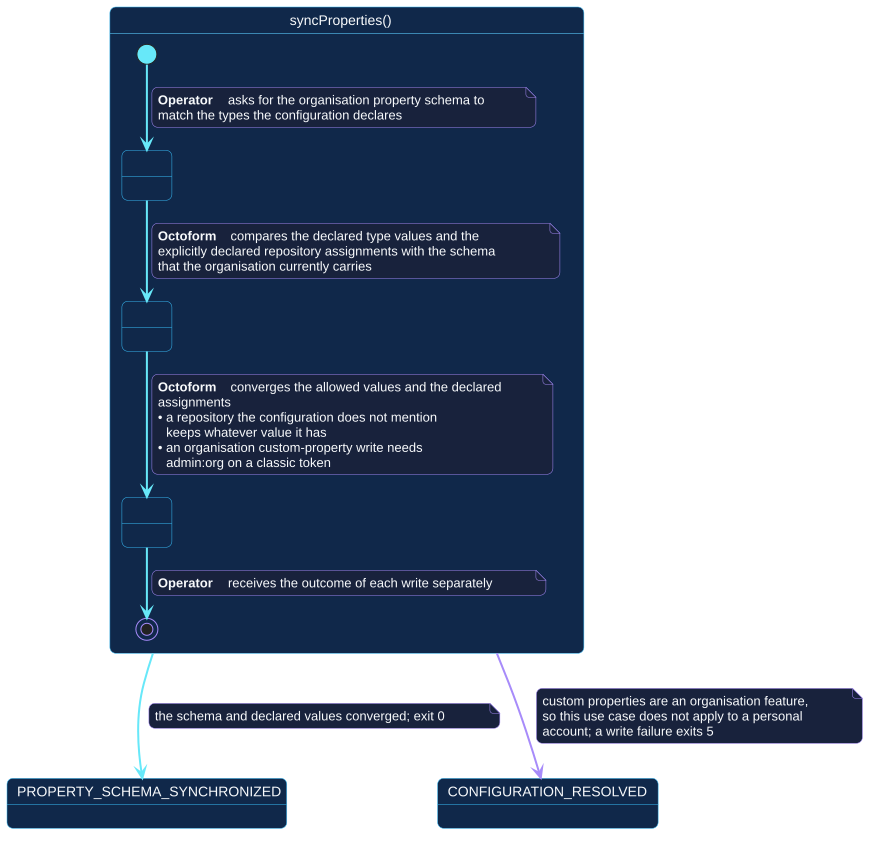

# `syncProperties()`

## Use-case information

| Attribute | Value |
| --- | --- |
| Name | `syncProperties()` |
| Primary actor | Repository operator |
| Goal | Make the organization property schema and the explicitly declared repository values match the configuration |
| Level | User goal |
| Type | Secondary |
| Precondition | The selected account is an organization; the token can write organization properties |
| Successful postcondition | Allowed values and declared assignments converged; each write reported separately |
| Failure postcondition | The reason is reported; nothing is assumed about unattempted writes |
| Command | `octoform properties sync` |

## Specification diagram

[Open the PlantUML source](../../../assets/diagrams/sources/uc-sync-properties.puml)

## Detailed conversation

| Turn | Party | Exchange |
| --- | --- | --- |
| 1 | Repository operator | Asks for the organization property schema to match the declared types |
| 2 | Octoform | Compares the declared type values and the explicitly declared repository assignments with the schema the organization currently carries |
| 3 | Octoform | Converges the allowed values and the declared assignments |
| 4 | Repository operator | Receives the outcome of each write separately |

## Omission is not deletion

A repository the configuration does not mention keeps whatever value it has.
The use case converges what was declared; it does not treat the configuration
as an exhaustive inventory of the organization. This is the same boundary that
governs every other policy in Octoform, and it is stated here because a
schema-shaped operation is exactly where a reader is most likely to expect
otherwise.

## Permission is specific

An organization custom-property write needs `admin:org` on a classic token. A
missing reported scope fails early with a remediation message rather than
partway through a run. Custom properties are an organization feature, so this
use case does not apply to a personal account at all.

## Internal states

| State | Description | Responsibility |
| --- | --- | --- |
| `RequestingSync` | The operator has asked for convergence | Establish the selection and the account kind |
| `Reconciling` | Declared values are being compared with the current schema | Consider only what the configuration declares |
| `Writing` | Convergence is being attempted | Report each write separately, and leave undeclared repositories alone |

## Connection with the operator context

- `CONFIGURATION_RESOLVED` → `syncProperties()` → `PROPERTY_SCHEMA_SYNCHRONIZED`
- `CONFIGURATION_RESOLVED` → `syncProperties()` → `CONFIGURATION_RESOLVED` when
  the account cannot support it or a write fails

## Vocabulary

**Repository operator** asks, receives.
**Octoform** compares, converges, reports. It does not remove a value it was
not asked about.

## References

- [`octoform properties sync`](../../../commands/properties-sync.md)
- [Classification and audit](../../../configuration/classification-and-audit.md)
- [Credentials and permissions](../../../security/credentials-and-permissions.md)
