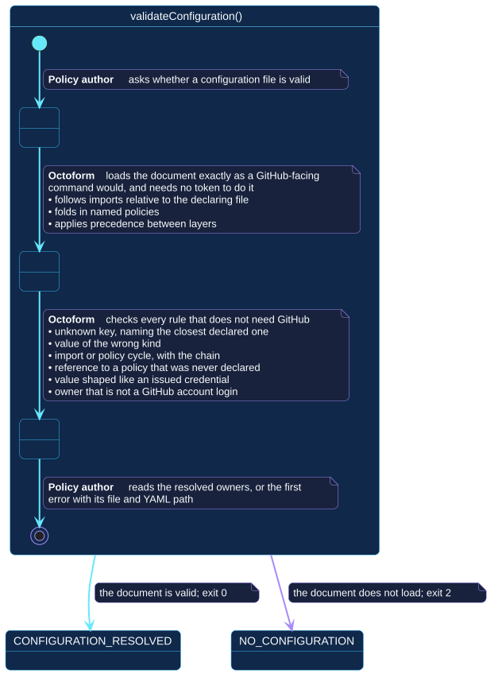

# `validateConfiguration()`

## Use-case information

| Attribute | Value |
| --- | --- |
| Name | `validateConfiguration()` |
| Primary actor | Policy author |
| Goal | Establish that a configuration document composes and validates, and learn which accounts it declares |
| Level | User goal |
| Type | Primary, essential |
| Precondition | A configuration file exists and is readable |
| Successful postcondition | The document is proven to resolve; its accounts are known |
| Failure postcondition | Nothing is established; the first error is reported with its file and YAML path |
| Command | `octoform config validate` |

## Specification diagram

[Open the PlantUML source](../../../assets/diagrams/sources/uc-validate-configuration.puml)

## Detailed conversation

| Turn | Party | Exchange |
| --- | --- | --- |
| 1 | Policy author | Asks whether a configuration file is valid |
| 2 | Octoform | Loads the document exactly as a GitHub-facing command would: follows imports relative to the declaring file, folds in named policies, applies precedence between layers |
| 3 | Octoform | Checks every rule that needs no GitHub state |
| 4 | Octoform | Reports the resolved accounts, or the first error with its file and YAML path |
| 5 | Policy author | Corrects the document, or proceeds knowing it resolves |

## What turn 3 checks

Each of these is reported with its location rather than as a generic parse
failure:

- an unknown key, named alongside the closest declared one;
- a value of the wrong kind;
- an import or policy cycle, with the chain that produced it;
- a reference to a policy that was never declared;
- a value shaped like an issued credential;
- a declared owner that is not a GitHub account login.

The last check does more work than it appears to. Every declared owner is
asked of the API by login, so a login carrying a path separator, a control
character, a leading or trailing hyphen, or a homoglyph that merely resembles
the intended account is caught here, with its reason, instead of surfacing as
an opaque `404` several requests into a later run.

## Internal states

| State | Description | Responsibility |
| --- | --- | --- |
| `RequestingCheck` | The author has asked, nothing has been read | Accept a path and nothing else |
| `Composing` | Imports and named policies are being folded in | Resolve exactly as a GitHub-facing command would, so the answer transfers |
| `Reporting` | The verdict is being presented | Name the file and the YAML path for any error, and never repeat a credential-shaped value |

## Connection with the operator context

This use case implements the transition out of `NO_CONFIGURATION`:

- `NO_CONFIGURATION` → `validateConfiguration()` → `CONFIGURATION_RESOLVED`
  when the document loads, exiting `0`;
- `NO_CONFIGURATION` → `validateConfiguration()` → `NO_CONFIGURATION` when it
  does not, exiting `2`.

The self-transition is the point of the use case. A document that fails to
load leaves the author holding exactly what they held before.

## Vocabulary

**Policy author** asks, corrects, proceeds.
**Octoform** loads, composes, checks, reports. It never repairs a document and
never guesses at an intended value.

## References

- [`octoform config`](../../../commands/config.md)
- [Document composition](../../../configuration/document-composition.md)
- [Operator context](../operator-context.md)
