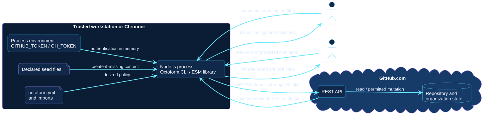

# Container view

In this view, a container is a separately executing or stored unit, not
necessarily a Docker image. Octoform runs as one Node.js process whether
invoked through its CLI or imported as an ESM library.

[Open the PlantUML source](../../assets/diagrams/sources/container-view.puml)

## Runtime containers and stores

| Element | Boundary |
| --- | --- |
| Octoform Node.js process | Executes CLI adapters, exported services, domain planning, and apply orchestration in memory. |
| Root YAML and imports | Version-controlled desired state managed by the operator or checked-out workflow revision. |
| Local seed files | Content read only when an effective `files` policy names it. |
| Process environment | Supplies `GITHUB_TOKEN` or `GH_TOKEN`; configuration cannot carry a token. |
| Octokit client | Adds authentication and transports REST requests over HTTPS. |
| Standard output and error | Carries human-readable repository details, plans, failures, and exit status context. |
| GitHub state | External source of truth for identity, permissions, repositories, settings, and resource outcomes. |

## Deployment consequences

There is no Octoform server, database, queue, or persisted plan service in
`0.3`. Process exit loses the computed plan. A later invocation observes and
plans again. Configuration history belongs in version control, while applied
state and mutation audit evidence belong to GitHub.

See [trust and data flow](../trust/trust-and-data-flow.md) for disclosure and
credential implications.
