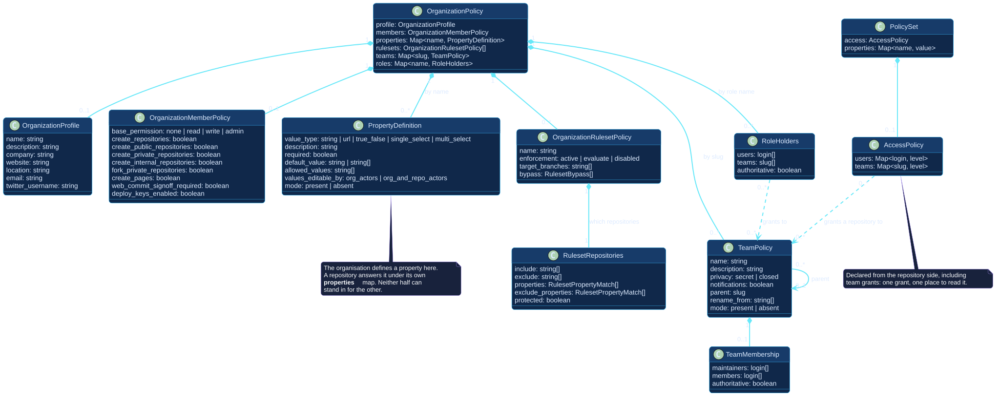

# Domain model

The domain separates desired configuration from observed GitHub state.
Planning produces an explicit `Change`; applying produces an outcome linked to
that change rather than mutating the desired or observed models in place.

[Open the PlantUML source](../../assets/diagrams/sources/domain-model.puml)

## Declared-state concepts

| Concept | Definition |
| --- | --- |
| `Config` | Composed and validated root intent for one or more owners, including precedence layers, classification, audit, and exclusions. |
| `OrganizationPolicy` | Desired state for the account itself: profile, member policies, property definitions, organization rulesets, teams and role assignments. |
| `PolicySet` | Desired fields applicable at defaults, type, or named-repository scope. |
| `RulesetPolicy` | One ruleset reduced to the fields Octoform manages, with its target, rules and bypass actors. |
| `BranchProtectionPolicy` | One branch's classic protection. |
| `AccessPolicy` | Who may reach one repository: collaborators by login, teams by slug. |
| `LabelPolicy`, `MilestonePolicy` | One collection entry, matched by name, optionally renamed or removed. |
| `EnvironmentPolicy` | One named environment and optional required user reviewers. |
| `FilePolicy` | One local-to-repository `create-if-missing` file declaration. |

The organization model has its own diagram, because the six parts of it refer
to each other and a reader following a child team to its parent should be able
to see both: [the organization model](#the-organization-model).

## Observed-state concepts

| Concept | Definition |
| --- | --- |
| `OrganizationState` | The account as it stands: its settings, property definitions, teams, roles and rulesets, each independently readable or not. |
| `RepoState` | Inventory-level repository identity, visibility, archive status, default branch, metadata, and resolved type. |
| `RepoDetail` | `RepoState` plus requested current settings and optional structural resources needed by planning. |
| `RepoStructure` | Policy-driven observations of rulesets, protection, collaborators, invitations, team access, labels, milestones, property values, environments, branch and file existence, and workflows naming the default branch. |
| `CapabilityEvidence` | Owner and response evidence used to decide whether an operation is available, unavailable, or still unknown. |

An unreadable setting is distinct from `null`. `null` can be a real GitHub
value, while unreadable means Octoform cannot establish current state safely.
The distinction is carried by one sentinel, and it does not matter which
transport failed to produce the value: a GraphQL read that failed narrows to
exactly the same unreadable state a REST read does.

## Planning and execution concepts

| Concept | Definition |
| --- | --- |
| `Change` | One difference: the account, optionally a repository, a key, an operation kind, a risk level, its prerequisites, current and desired values, plus optional block, warning, or endpoint payload. |
| `AppliedChange` | Success or failure outcome for an attempted executable change. |

Blocked changes remain `Change` instances so reports preserve intent and
reason. They have no `AppliedChange` because the applier never receives them.
See [state models](../behavior/state-models.md) for the lifecycle.

### A change need not belong to a repository

`Change.repo` is optional. A change to the account itself has no repository to
name, and inventing one would make it group and count as though it did — which
matters, because a repository really can be called the same thing as the
organization that owns it.

### Changes refer to each other

`prerequisites` names the changes a change waits for. It is what makes apply
order a property of the model rather than of the order the code happens to
call things in, and it is what lets a dependent be **blocked** when its
prerequisite failed instead of attempted against a resource that does not
exist. See [owner reconciliation](../behavior/owner-reconciliation.md).

## The organization model

[Open the PlantUML source](../../assets/diagrams/sources/organization-domain-model.puml)

Three relationships in that diagram carry decisions worth stating.

**A team names its parent by slug**, which is why teams are a map keyed by slug
rather than a list. A list would make the reference point at a position instead
of at a name.

**A property definition and a property value are different classes.** The
organization defines; a repository answers. Neither half can stand in for the
other, and the same word twice is GitHub's.

**Team repository access hangs off the repository, not the team.** A team is
declared under the organization and granted access under `access.teams` in a
policy layer. Two places to declare one grant would be two places for them to
contradict each other.
