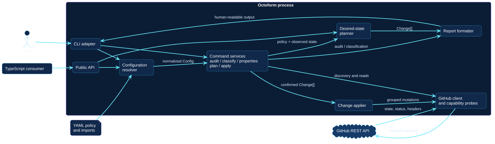

# Runtime components

The component view separates interface adapters, application orchestration,
domain logic, configuration, and GitHub infrastructure. This makes the shared
path between CLI and public ESM consumers explicit.

[Open the PlantUML source](../../assets/diagrams/sources/runtime-components.puml)

## Interface adapters

- **CLI parser and dispatcher** validates arguments, selects a command, checks
  authentication requirements, and translates completion into an exit code.
- **Public ESM exports** expose supported configuration, observation,
  classification, planning, apply, reporting, and type building blocks.
- **Report formatter** converts findings, changes, blocks, warnings, and apply
  outcomes into human-oriented text.

## Application services

The command-services component exposes audit, classification, property
synchronization, plan, and apply operations and owns their workflow order.
`apply` depends on planning and retains the displayed `Change[]`; it does not
independently construct another desired-state diff.

## Domain and configuration

- The loader composes imports and validates a normalized `Config`.
- The selector establishes the repository set and filters.
- The resolver produces an effective `PolicySet` for one repository.
- The planner compares policy, observed detail, and capability evidence without
  performing network calls or mutations.

## GitHub infrastructure

The observer gathers only policy-relevant state. Capability probes preserve
uncertainty instead of converting opaque responses into availability. The
applier groups confirmed executable changes by endpoint behavior, while the
Octokit client owns REST transport.
