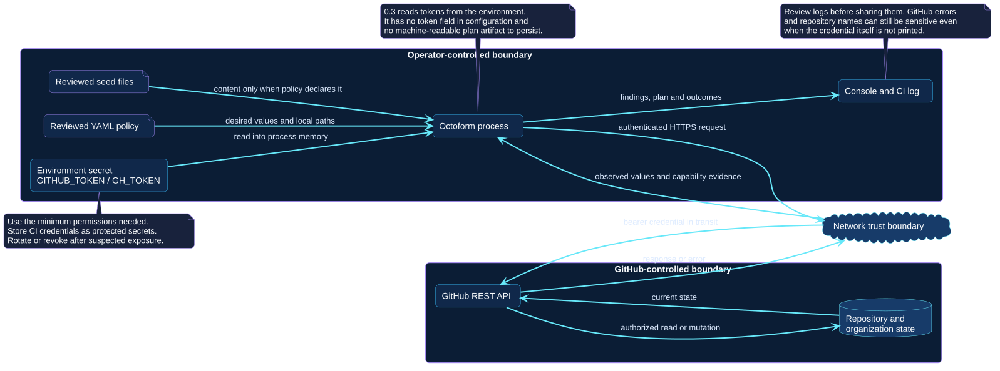

# Trust and data flow

The data-flow view focuses on information crossing operator-controlled,
network, and GitHub-controlled boundaries.

[Open the PlantUML source](../../assets/diagrams/sources/trust-and-data-flow.puml)

## Sensitive inputs and outputs

| Flow | Control |
| --- | --- |
| Token → process | Use environment injection, minimum permissions, protected secret storage, and rotation. |
| Configuration → process | Require repository review because it selects owners, repositories, desired values, and local content. |
| Seed files → process | Review content and relative path provenance before permitting creation. |
| Process ↔ GitHub | Use authenticated HTTPS; treat response fields and status codes as state and capability evidence. |
| Process → logs | Restrict retention and audience because names, private topology, current settings, and API errors can be sensitive. |

Octoform `0.3.1` has no token configuration field and no persistent plan
store. This reduces credential serialization but does not make console output
public-safe.

Use [Security and trust](../../security/index.md) for credential selection,
rotation, incident response, and automation controls.
