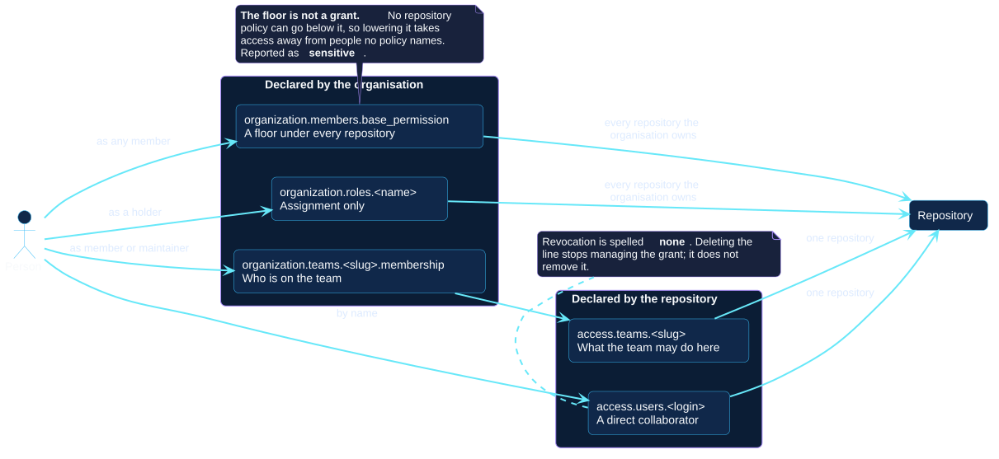

# Teams and access

Four mechanisms decide whether somebody can reach a repository. This example
uses all four, and the point of it is where each one is declared.

<div class="octoform-example" markdown>

```yaml title="octoform.yml"
--8<-- "docs/examples/files/teams-and-access/octoform.yml"
```

[:material-download: Download YAML](files/teams-and-access/octoform.yml){ .octoform-example-download download="octoform.yml" aria-label="Download the teams and access YAML" }

</div>

## The four paths

<div class="octoform-diagram" role="region" aria-label="Scrollable UML diagram of the four ways a person reaches a repository" tabindex="0" markdown>



</div>

[Open the PlantUML source](../assets/diagrams/sources/access-reach.puml)

| Path | Declared under | Reaches |
| --- | --- | --- |
| [`base_permission`](../configuration/organization.md#members) | The organization | Every repository it owns |
| [An organization role](../configuration/roles.md) | The organization | Every repository it owns |
| [A team](../configuration/teams.md) plus [`access.teams`](../configuration/access.md) | The organization, then the repository | The repositories that grant it |
| [`access.users`](../configuration/access.md) | The repository | That repository |

The example starts from `base_permission: none`, so every path into a
repository is one the file states. That is the arrangement worth aiming at, and
it is a large change to make on an organization that has been running on a
`read` or `write` floor — see step 2 of the
[organization example](organization.md#2-members-read-carefully).

## Why a team grant is declared on the repository

A team is created under `organization.teams`. What it may *do* to a repository
is declared under that repository's `access.teams`.

Splitting it that way is deliberate. One grant has one place to read it; two
places to declare it would be two places for them to contradict each other. It
also means the question "who can reach this repository?" is answered by
reading that repository's policy, rather than by searching the whole file for
teams that mention it.

## Nesting, and the order it forces

`platform-oncall` names `platform` as its parent. Three things follow, and none
of them depends on the order the file is written in:

- If this run creates both, the parent is attempted first.
- If the parent's creation fails, the child is **blocked** rather than sent to
  sit under a team that does not exist.
- Neither can be `secret`: a team with a parent cannot be, and neither can a
  team with children. Octoform refuses that shape while planning rather than
  sending it and being refused.

## Read the room before applying

```console
octoform inspect members --config octoform.yml
```

Every login this file names is checked against the people the organization
actually has:

```text
  named by the configuration but not in the organisation:
    example-dev-b: organization.teams.platform-oncall.membership.members
    example-contractor: repos.example-service.access.users
```

Those are the grants that will turn into invitations. An invitation nobody
accepts is access that never arrives while the file goes on claiming it does —
and somebody who is not in the organization at all cannot be put on one of its
teams, so that line will block until they are.

Adding them is [a command](../commands/members.md), one person at a time:

```console
octoform members invite --user example-dev-b --role direct_member
```

## Removal is always a word

Nothing in this file removes anybody by omission.

- `access.users.example-former-contractor: none` revokes the grant. Deleting
  the line would only stop managing it.
- `membership.authoritative: false` — the default — means the membership lists
  add people and never remove them. Setting it to `true` is what asks for
  removal, and it is refused if the lists name nobody, or if it would remove
  the account the run is authenticated as.

Both revocations are reported as `destructive`. Taking somebody off a team
takes them out of every repository that team reached.
